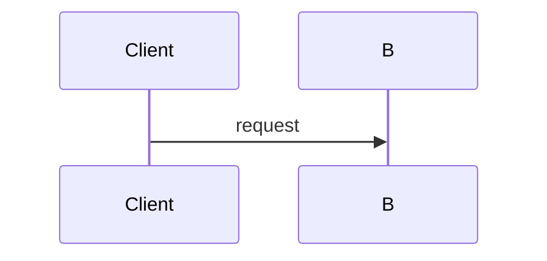

# Documentation

The published documentation site is built with **MkDocs Material** from
`docs/manual/`, configured by `mkdocs.yml` at the repository root, and published
to GitHub Pages by `.github/workflows/docs.yml`.

## The rule

**Every PR that changes behavior, portal pages, the REST API, or configuration
updates the affected documentation pages in the same PR.** Documentation is not
a follow-up task; a feature is not done until its pages describe it.

Concretely, if a change touches:

- a REST endpoint → update the matching page under `docs/manual/reference/api/`
- a `skills-gateway.*` property or `application.yaml` → update
  `docs/manual/reference/configuration.md`
- a portal page or control → update `docs/manual/reference/portal.md`
- the facade, allowlists or pinned-ref behavior → update
  `docs/manual/reference/git-facade.md` and
  `docs/manual/reference/compatibility.md`
- a new user-facing capability → add or update a guide, and cross-link it

## Verify locally

```bash
pip install -r docs/requirements.txt
mkdocs build --strict
```

`--strict` turns broken internal links and nav warnings into failures, which is
what makes it usable as a gate. It is the **fifth gate** alongside `mvnw clean
verify`, the portal e2e suite, reqstool and OpenSpec.

## Structure

`docs/manual/` is the site root (`docs_dir`). The sibling `docs/reqstool/` and
`docs/decisions/` are **not** part of the site and must not be moved into it.

| Section | Answers | Contains |
| --- | --- | --- |
| `index.md` | "What is this and why does it exist?" | Background, the need, the non-negotiable goals, a threat-model summary |
| `concepts/` | "How does it work?" | The lifecycle, snapshots and the ledger, trust boundaries, glossary. Explanation, not instructions |
| `guides/` | "How do I do X?" | Task-shaped, start to finish, with runnable commands |
| `reference/` | "What exactly is the contract?" | Configuration, REST API, facade, compatibility matrix, portal pages, ADR index. Exhaustive and lookup-shaped |

Add a page to `nav:` in `mkdocs.yml` when you create it — an unlisted page is a
build warning under `--strict`.

## Writing conventions

- Document **what the code does today**, not what is designed or planned. When
  scope limits matter, state them plainly and say they are enforced.
- Never restate requirement text — `docs/reqstool/` is the single source of
  truth for requirements. Link or paraphrase behavior instead.
- Reference pages describe the contract; guides describe a task. Do not turn a
  reference page into a tutorial.
- Prefer tables for anything enumerable: status codes, properties, columns,
  fields.
- Use Material admonitions for real caveats — `!!! warning` for destructive or
  security-relevant behavior, `!!! danger` for anything that must never reach
  production, `!!! note` and `!!! tip` sparingly. Do not decorate ordinary prose.
- Use `=== "Tab"` content tabs for genuine alternatives (portal versus API,
  different clients), not to hide detail.
- Internal links are relative Markdown links to the `.md` file
  (`../reference/portal.md#audit-log`). `--strict` verifies them.
- Links to repository files that are outside the site (ADRs, `ARCHITECTURE.md`)
  must be absolute GitHub URLs, since they are not part of `docs_dir`.

## Diagrams

Mermaid renders natively through `pymdownx.superfences`. There is no external
renderer and no image checked in.

````markdown

````

| Use | Diagram type |
| --- | --- |
| A process end to end | `flowchart` |
| An interaction ordered in time | `sequenceDiagram` |
| The states of an object and its transitions | `stateDiagram-v2` |
| Architecture / container views | Mermaid **C4** syntax (`C4Container`) |

Rules:

- Diagrams must match the code. Never invent a component, a queue, or a service
  that does not exist in `src/`.
- Label edges with the real trigger — an endpoint path, a ref name, a state —
  rather than a vague verb.
- One diagram per idea. A diagram that needs a paragraph to decode should be two
  diagrams or a table.

## Versioning

Published versions are managed by **mike**:

- Every push to `main` redeploys the rolling `dev` version.
- A `v*` tag deploys that release and moves the `stable` alias to it; the first
  such tag also makes `stable` the default landing version.

Do not deploy versions by hand, and do not commit to `gh-pages` — the workflow
owns that branch.
