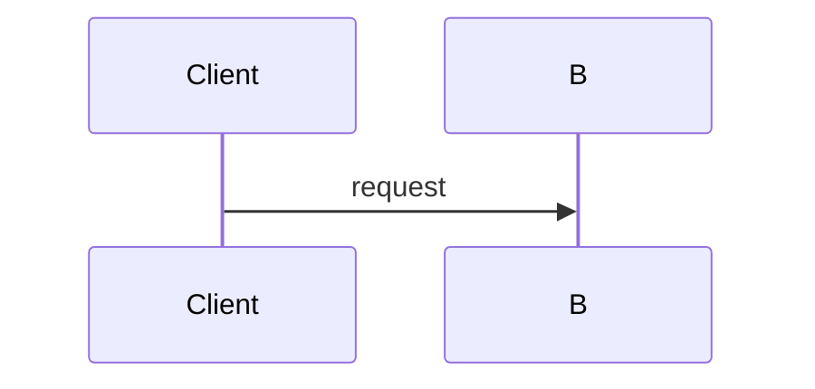

# Documentation

The published documentation site is built with **MkDocs Material** from
`docs/manual/`, configured by `mkdocs.yml` at the repository root, and published
to GitHub Pages by `.github/workflows/docs.yml`.

## The rule

**Every PR that changes behavior, portal pages, the REST API, or configuration
updates the affected documentation pages in the same PR.** Documentation is not
a follow-up task; a feature is not done until its pages describe it.

Concretely, if a change touches:

- a REST endpoint → update the matching page under `docs/manual/reference/api/`
- a `skills-gateway.*` property or `application.yaml` → update
  `docs/manual/reference/configuration.md`
- a portal page or control → update `docs/manual/reference/portal.md`
- the facade, allowlists or pinned-ref behavior → update
  `docs/manual/reference/git-facade.md` and
  `docs/manual/reference/compatibility.md`
- a new user-facing capability → add or update a guide, and cross-link it

## Verify locally

```bash
pip install -r docs/requirements.txt
mkdocs build --strict
```

`--strict` turns broken internal links and nav warnings into failures, which is
what makes it usable as a gate. It is the **fifth gate** alongside `mvnw clean
verify`, the portal e2e suite, reqstool and OpenSpec.

## Structure

`docs/manual/` is the site root (`docs_dir`). The sibling `docs/reqstool/` and
`docs/decisions/` are **not** part of the site and must not be moved into it.

| Section | Answers | Contains |
| --- | --- | --- |
| `index.md` | "What is this and why does it exist?" | Background, the need, the non-negotiable goals, a threat-model summary |
| `concepts/` | "How does it work?" | The lifecycle, snapshots and the ledger, trust boundaries, glossary. Explanation, not instructions |
| `guides/` | "How do I do X?" | Task-shaped, start to finish, with runnable commands |
| `reference/` | "What exactly is the contract?" | Configuration, REST API, facade, compatibility matrix, portal pages. Exhaustive and lookup-shaped |

That is the directory layout, and it is the *only* thing the directory decides.

### The site follows [Diátaxis](https://diataxis.fr)

Four kinds of page, split by what the reader needs right now. **Ask which one
you are writing before you write it** — most bad documentation is two types in
one page.

| Type | The reader's need | Test | Here |
| --- | --- | --- | --- |
| **Tutorial** | Learning — a guided first success, for someone who does not yet know what they want | Could a newcomer follow it start to finish and have something working? | `guides/local-development.md` |
| **How-to guide** | A goal — solving one problem, for someone who already knows what they want | Does it name a task in its title and finish it? | Most of `guides/` |
| **Reference** | Facts — describing the machinery, consulted not read | Is it exhaustive, lookup-shaped, and boring on purpose? | `reference/`, the capability map, the glossary |
| **Explanation** | Understanding — why it is like this | Does it discuss and give context rather than instruct? | `architecture.md`, `concepts/` |

The distinction that is easiest to get wrong is **tutorial versus how-to**. A
tutorial is for someone learning; it makes choices for them and does not
enumerate alternatives. A how-to is for someone working; it assumes competence
and may branch. "Try it locally" is the one tutorial, and it must stay one.

The `How-to guides` section is grouped by topic — *Deploy and operate*, *Govern
the estate*, *Consume skills*, *Maintain the project*. That grouping is inside
one Diátaxis type, which the framework allows; it is not a second taxonomy. Do
not add such a grouping to any other section.

A new page goes in `guides/`, `reference/` or `concepts/` on disk by its type,
and into the matching nav section.

**Add every new page to `nav:` in `mkdocs.yml`.** Nothing enforces this: an
unlisted page still builds, is still rendered, and is still served at its URL,
and `mkdocs build --strict` exits 0 without a warning. That is also why a page
that should not be published has to be **deleted** rather than dropped from the
nav.

## Writing conventions

- Document **what the code does today**, not what is designed or planned. When
  scope limits matter, state them plainly and say they are enforced.
- Never restate requirement text — `docs/reqstool/` is the single source of
  truth for requirements. Link or paraphrase behavior instead.
- Reference pages describe the contract; guides describe a task. Do not turn a
  reference page into a tutorial.
- Prefer tables for anything enumerable: status codes, properties, columns,
  fields.
- Use Material admonitions for real caveats — `!!! warning` for destructive or
  security-relevant behavior, `!!! danger` for anything that must never reach
  production, `!!! note` and `!!! tip` sparingly. Do not decorate ordinary prose.
- Use `=== "Tab"` content tabs for genuine alternatives (portal versus API,
  different clients), not to hide detail.
- Internal links are relative Markdown links to the `.md` file
  (`../reference/portal.md#audit-log`). `--strict` verifies them.
- Links to repository files that are outside the site (ADRs, `docs/reqstool/`)
  must be absolute GitHub URLs, since they are not part of `docs_dir`.
- **An ADR is cited by linking the ADR itself, and never summarized on the
  site.** Name it in full — `[ADR 0012 — A JVM container is the release
  artifact](https://github.com/…/docs/decisions/0012-….md)` — so the reader
  knows what the decision says without opening it. The site once carried an
  index page paraphrasing every ADR; it was deleted because a paraphrase is a
  second copy that goes stale, and because the decision record is a repository
  artifact for contributors, not published documentation. `architecture.md` and
  `concepts/trust-boundaries.md` are where the site explains *why*.

## Diagrams

Mermaid renders natively through `pymdownx.superfences`; that is the default
for every diagram. There is no external renderer.

**Exception — headline diagrams.** A diagram that carries a page's thesis
(currently the lifecycle flowchart) is rendered as a checked-in SVG pair
generated from a Mermaid source in `docs/diagrams/*.mmd`. That workflow —
sources, skin, regeneration, embedding — is owned by
`.claude/skills/docs-diagrams`; load it before touching any `.mmd`, any
`assets/diagrams/*.svg`, or a page containing a `dd-diagram` block.

````markdown

````

| Use | Diagram type |
| --- | --- |
| A process end to end | `flowchart` |
| An interaction ordered in time | `sequenceDiagram` |
| The states of an object and its transitions | `stateDiagram-v2` |
| Architecture / container views | Mermaid **C4** syntax (`C4Container`) |

Rules:

- Diagrams must match the code. Never invent a component, a queue, or a service
  that does not exist in `src/`.
- Label edges with the real trigger — an endpoint path, a ref name, a state —
  rather than a vague verb.
- One diagram per idea. A diagram that needs a paragraph to decode should be two
  diagrams or a table.

## Versioning

Published versions are managed by **mike**:

- Every push to `main` redeploys the rolling `dev` version.
- A release deploys its own version and moves the `stable` alias to it; the
  first release also makes `stable` the default landing version. Releases reach
  this workflow through `release.yml`, which calls it after the approval gate —
  `docs.yml` does **not** watch for tags, so a hand-pushed tag publishes
  nothing. See `docs/manual/guides/releasing.md`.

Deployment itself runs in this workflow via `actions/deploy-pages`, which needs
the repository's Pages source set to GitHub Actions. `mike` still owns
versioning on `gh-pages`.

Do not deploy versions by hand, and do not commit to `gh-pages` — the workflow
owns that branch.
