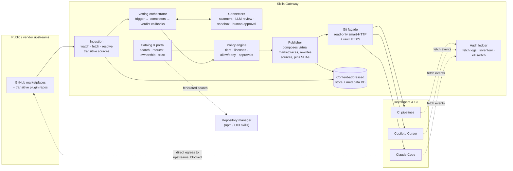

# Architecture

!!! note
    This is the system design document — it records the threat model, the
    decided architecture, the roadmap, and the open questions, including parts
    that are not implemented yet. For what the code does today, see the
    [concepts](concepts/lifecycle.md) and [reference](reference/configuration.md)
    sections; implementation notes below are marked as such.

**Status:** Draft proposal · **Date:** 2026-08-13

An enterprise gateway for git-distributed AI agent skills and skill
marketplaces (Claude Code, GitHub Copilot, Cursor, …) — the missing analogue of
a repository manager for the part of the skills ecosystem that never touches a
package manager.

---

## 1. The gap

Agent skills reach developer machines through two distribution channels today:

1. **Package-manager distribution** (npm, PyPI, OCI). Already governable: point
   the client at a repository manager's remote+virtual repository and you get
   proxying, caching, artifact scanning, immutable versions, and audit logs
   for free. **This is a solved problem — the gateway should not rebuild it.**

2. **Git distribution.** Claude Code plugin *marketplaces* are git repositories
   containing a `.claude-plugin/marketplace.json`; installing a plugin performs
   a `git clone` from GitHub (or wherever the source points). The open Agent
   Skills format (`SKILL.md`) adopted by Copilot and Cursor follows the same
   pattern: "point your tool at this repo/folder." There is **no proxy point,
   no immutable versioning, no scanning hook, no inventory** — every developer
   laptop clones straight from the public internet.

Registry-style governance products are starting to treat skills as a
governed-artifact problem, which is the right framing — but that framing
assumes package distribution and so reaches only channel 1. Channel 2 is
where the ecosystem's growth actually is (community marketplaces, vendor
marketplaces, internal repos), and it is the channel Security currently cannot
see.

**Skills Gateway is the choke point for channel 2, federated with the existing
repository manager that already covers channel 1.**

### Related work

Two projects have begun to address channel 2, and both stop at the registry
layer rather than the serving layer — which is the distinction this design
turns on.

- **LiteLLM Skills Gateway**
  ([docs](https://docs.litellm.ai/docs/skills_gateway)) — a registry and
  discovery plane for Claude Code skills. Teams register a skill
  with a `github`, `url`, or `git-subdir` source, an admin toggles it public,
  and the proxy serves a `marketplace.json` at
  `GET /claude-code/marketplace.json` that clients add as a marketplace.
  This solves inventory and discovery, and its "make public" toggle is a
  genuine approval gate. What the documentation describes is a manifest of
  *upstream* sources: no snapshot of the content, no commit-SHA pin, and no
  scanning hook. Clients therefore still dereference the upstream URL, so
  mutable refs (T3) and transitive plugin sources (T4) remain live, and the
  proxy is not on the fetch path where an audit ledger or an egress control
  could sit.
- **agentgateway** ([issue #3094](https://github.com/agentgateway/agentgateway/issues/3094))
  — an open feature request for skill discovery across multi-agent systems.
  It is explicitly a *metadata and discovery* proposal: skills stay wherever
  they live (filesystem, git, private registry) under their creators'
  ownership, and the gateway indexes them. Distributed ownership is a stated
  goal rather than an omission, so governance of the artifact itself is out of
  scope by design.

Both confirm the demand and neither occupies the choke point. Indexing
upstream URLs makes the estate *visible*; only re-serving pinned, rewritten
content makes it *governable*. That is the difference between principle 1
("be the only door") and a catalog.

## 2. Why skills are a real attack surface

Skills are not configuration files. Threat model, specific to how these
artifacts actually work:

| # | Threat | Mechanism | Covered by existing tooling? |
|---|--------|-----------|------------------------------|
| T1 | Malicious instructions | `SKILL.md`, slash commands, and agent definitions are *prose that executes* with the agent's privileges — prompt injection, "also exfiltrate `~/.aws/credentials` to…", instructions that weaken future reviews | No — SAST does not parse prose |
| T2 | Auto-executing code | Claude Code plugins can register **hooks** (shell commands that fire automatically on events) and **MCP servers** (long-lived processes). Installing a plugin can mean arbitrary code execution without the user ever invoking a skill | Partially (generic malware scanning, if the code ever passes through a scanner — which git cloning skips) |
| T3 | Rug pulls | Git refs are mutable. A marketplace reviewed on Monday can serve different content Tuesday at the same URL — `marketplace update` happily pulls it | No — this is exactly what pinned, immutable registry versions exist to prevent, and git distribution has none |
| T4 | Transitive sources | `marketplace.json` plugin entries may point at *other* arbitrary git repositories. Vetting the marketplace repo does not vet what an install actually clones | No |
| T5 | Typosquatting / lookalikes | No namespace authority in the git world; `owner/claude-skills` vs `0wner/claude-skills` | No |
| T6 | Inventory blindness | When a community skill is disclosed as malicious, no one can answer "which of our 4,000 developers has it installed, at which version?" | No |
| T7 | License / compliance | Skills embed third-party content and code with licenses nobody recorded | Partially |

T1–T4 are the ones no current product addresses; T3+T4 together are the reason
naive mirroring is insufficient.

## 3. Design principles

1. **Be the only door.** Governance that depends on developers voluntarily
   using the right URL is documentation, not control. The gateway is enforced
   by network egress policy and fleet-managed client settings, and made
   *preferable* by being faster and easier than going direct.
2. **Speak the client's native protocols.** Claude Code fetches marketplaces
   over git smart-HTTP and raw HTTPS. The gateway presents itself as exactly
   that — a read-only git server — so clients need **zero modification**:
   `claude plugin marketplace add https://skills.corp.example/m/approved`.
3. **Layer immutability over mutable git.** Every approved artifact is pinned
   to an upstream commit SHA and republished as an immutable, content-addressed
   snapshot. Published refs only ever move forward through the approval
   pipeline, never because upstream moved.
4. **Rewrite, don't just mirror.** Ingestion resolves every transitive plugin
   source, mirrors it, and rewrites `marketplace.json` so **every URL a client
   will ever dereference resolves inside the gateway** (kills T3/T4).
5. **Risk-tiered friction.** A markdown-only skill and a plugin that registers
   shell hooks are different animals; review effort must match (see §6), or
   admins drown and users route around the system.
6. **Complement the existing repository manager.** npm/OCI-packaged skills
   stay there. The gateway federates its catalog with it so users get one
   search plane, and Security gets one policy conversation.

## 4. System architecture



### Components

- **Git façade.** A read-only git smart-HTTP server serving (a) generated
  *virtual marketplaces* and (b) mirrored, pinned plugin repos, at stable
  internal URLs. Authenticated via SSO-issued tokens (standard git credential
  helper flow). This is the only surface end users ever talk to.
- **Machine API chain.** A stateless sibling of the façade's chain for
  `/api/**` requests carrying `Authorization: Bearer`, so infrastructure-as-code
  and CI can configure the gateway with no browser. It authenticates only a
  credential holding a non-empty API scope list, honours no cookie and refuses a
  request presenting one, and authorizes against an allowlist that excludes
  every act of human judgement, every retraction of content, every role grant
  and all credential minting. The guarantee runs both ways: a façade credential
  reaches no API endpoint, and an API credential reaches no marketplace — see
  [Trust boundaries](concepts/trust-boundaries.md).
- **Ingestion.** Watches registered upstreams for new commits/tags, fetches the
  marketplace repo, parses the manifest, **recursively resolves every plugin
  source** (relative paths, external git URLs, GitHub refs), and snapshots the
  whole closure into content-addressed storage keyed by commit SHA.
  **MVP scope: local sources only** — plugins must live inside the marketplace
  repo as relative paths; every external source type (`github`, `url`,
  `git-subdir`, `npm`, `archive`) is rejected fail-closed at ingestion. This
  removes transitive resolution and source rewriting from the MVP entirely
  (relative sources resolve inside the served snapshot by themselves); the
  closure/rewrite machinery arrives with external-source support in Phase 2.
- **Vetting orchestrator (connector-based).** The gateway does not vet
  content itself — it orchestrates. Per snapshot it emits a vetting trigger
  (webhook/queue event carrying snapshot metadata and a fetch URL for the
  content), fans it out to the configured connectors, and receives
  asynchronous result callbacks. A connector is anything that can take the
  trigger and eventually answer
  `{connector, snapshot, verdict, report-url, findings[]}`:
  - *Scanners:* artifact and vulnerability scanners, malware signatures,
    dependency and secret scanning, license checks,
    obfuscation/invisible-Unicode detection in markdown.
  - *LLM semantic review:* reads `SKILL.md`/commands/agents for
    malicious-instruction payloads (T1) — does this instruct the agent to
    access credentials, make network calls, modify files outside its stated
    purpose, alter its own review process? A triage signal, not a verdict.
  - *Sandbox runners:* execute bundled scripts and hooks in an instrumented
    sandbox; record file, network, and process behavior (T1/T2 tiers).
  - *Human processes:* a Jira ticket, a review queue — the MVP "connector" is
    simply an approve button in the portal.

  Results are normalized and attached to the snapshot forever. One analysis
  stays built-in because tiering depends on it: *manifest analysis* —
  enumerating registered hooks, MCP servers, commands, and agents (§6).
- **Policy engine.** Policy-as-code consuming snapshot facts and the
  normalized connector verdicts. The engine is embedded CEL (ADR 0006), and
  its first slice ships: [deny rules](guides/policy-rules.md) evaluated
  fail-closed at approval time, with a playground and ledger provenance.
  The rest of the sketch — which connectors are required per tier,
  auto-approval conditions, license allowlists, org/team scoping, mandatory
  reviewers for T2 — attaches to the same engine if and when those are
  decided (auto-approval deliberately parked: it would delegate the human
  gate, a product decision, not a feature).
- **Publisher.** Composes virtual marketplaces per audience (org-wide, per
  team, pilot ring) from approved snapshots — exactly the repository
  manager's local + remote + virtual model. Generates `marketplace.json` with **every
  source rewritten** to façade URLs and pinned with an explicit commit `sha`
  (plugin source entries support `ref` and 40-char `sha` pinning; when both
  are set the `sha` wins) — so the pin is enforced by the client's own git
  fetch, not just by gateway behavior.
- **Catalog & portal.** Search across gateway *and* federated
  repository-manager skills; per-skill page with scan history, tier, owner, install count, trust
  signals; "request this upstream skill" button feeding the approval queue.
- **Audit ledger.** Append-only record of every fetch (who, what, which SHA,
  when), every approval (who, what diff, which scan report), every recall.
  Streams to the SIEM.

## 5. Lifecycle of a skill

```mermaid
sequenceDiagram
    actor Dev as Developer
    participant Portal as Catalog/Portal
    participant Ing as Ingestion
    participant Vet as Vetting connectors
    participant Rev as Reviewer (tiered)
    participant Pub as Publisher
    participant Fac as Git façade

    Dev->>Portal: request upstream skill X
    Portal->>Ing: register upstream
    Ing->>Ing: fetch @ SHA abc123, resolve transitive sources
    Ing->>Vet: snapshot → vetting trigger
    Vet->>Rev: verdict callbacks + computed tier (T0 may auto-approve)
    Rev->>Pub: approve X @ abc123
    Pub->>Fac: republish marketplace with X pinned
    Dev->>Fac: claude plugin install X (from corp marketplace)

    Note over Ing,Pub: Later: upstream pushes new commit
    Ing->>Vet: new snapshot @ def456 — held, NOT served
    Vet->>Rev: diff vs approved (semantic diff of SKILL.md,<br/>new hooks/MCP flagged)
    Rev->>Pub: promote def456 (or reject; abc123 keeps serving)
```

The held-update behavior is the rug-pull defense: upstream movement never
changes what clients receive until the new snapshot passes the same gate the
old one did. Tier-0 diffs that stay tier-0 and scan clean can auto-promote on
a configurable delay (a cooling-off window also defeats
push-then-quickly-revert attacks).

Implemented today (GW_0073): a global
`skills-gateway.vetting.minimum-release-age` (default `0`, off) that the manual
approval gate enforces — a snapshot whose commit this gateway first ingested
less than that long ago is refused, whatever its verdicts say. The age is taken
from the gateway's own first sighting, never from the commit's timestamp, and it
is compared at each approval request rather than tracked, so the wait clears
itself. This is the window any future auto-promotion is conditioned on;
per-marketplace and per-tier ages ride on the policy rules.

Implemented today (GW_0096, GW_0097): **separation of duties** on that same
gate. The marketplace's registrant and each snapshot's ingestion actor are
recorded as attributes of the objects themselves, and an approval by the
registrant, by the ingestion actor, or by the author of a waiver the approval
relies on is a *four-eyes conflict*. What the conflict does is
`skills-gateway.approval.four-eyes.mode`: `warn` — the default — records it on
the ledger and lets the approval through, `enforce` refuses it fail-closed and
leaves the snapshot held. The default is what keeps a single-administrator
deployment approvable at all, and there is deliberately no mode that stops the
detection, so a self-approval is on the ledger either way. The automated sync
actors are recorded but never conflict. What is *not* implemented is a
two-approval queue: this refuses a conflicted decision rather than requiring a
second one.

**Recall (kill switch):** marking a snapshot revoked (a) removes it from every
virtual marketplace, (b) makes the façade refuse its mirror refs, (c) produces
the blast-radius report from the ledger (every identity that ever fetched it),
and (d) optionally pushes a fleet-managed settings change to force uninstall.

Implemented today (GW_0049–GW_0055): a `revoked` snapshot state, removal of both
published refs (`refs/heads/main` when it is still the tip, and the advertised
`refs/snapshots/<sha>`), and the blast-radius report from the fetch ledger at
`GET /api/snapshots/{id}/fetchers`. What triggers the recall is **continuous
re-vetting** — the chain re-run over approved content on a schedule — rather
than only a human pressing a button, so an acceptance that expired or a
connector rule that landed retracts content without waiting to be noticed.
Two limits are deliberate:

- Enforcement is **opt-in** (`skills-gateway.vetting.revet.mode`, default
  `warn`). Retracting content teams already depend on must never begin because
  of an upgrade.
- A run that blocks only because a connector **errored** never revokes. An error
  is evidence about the scanner, not the content, and fail-closed there would
  let one connector outage revoke an estate. Fail-closed still governs every
  path that *publishes*.

(d) — fleet force-uninstall — remains Phase 3.

### Refs: serving more than `main`

Consumers can pin a branch or tag when adding a marketplace
(`marketplace add <url>#release-1.x`), and users legitimately need release
branches, not only the default branch. The gateway handles this by making
**promotion per-(upstream, ref)**:

- Each ref an audience needs (`main`, `release/1.x`, a tag) is registered and
  vetted as its own line. The published repo carries one branch per vetted
  ref, each advancing independently through the same held-update gate.
- Unvetted refs simply do not exist on the façade — the published repo
  contains only promoted refs and their objects, so `#experimental` fails
  closed, ideally with a pointer to "request vetting of this ref" in the
  portal.
- The security boundary is unchanged regardless of which ref a user tracks:
  the plugins inside the generated `marketplace.json` are still pinned by
  commit `sha`.
- **MVP scope: default branch only.** Additional refs are a registration
  feature, not an architecture change — the first portal feature after the
  MVP.

## 6. Risk tiers

| Tier | Contents | Review | Update policy |
|------|----------|--------|---------------|
| **T0** | `SKILL.md` + reference docs only. No scripts, no hooks, no MCP servers | Automated scans + LLM review; auto-approve on clean | Auto-promote after cooling-off window |
| **T1** | Skills bundling scripts/executables the agent may run | T0 checks + sandbox run + human spot-check | Human-approved diff |
| **T2** | Plugins registering hooks, MCP servers, or commands that execute code on install/events | Full security review, named internal owner required | Mandatory re-review of every diff |

A snapshot's tier is computed by manifest analysis, never self-declared. A T0
skill that grows a `scripts/` directory in an update is automatically re-tiered
— that transition is itself a review trigger.

## 7. Versioning and provenance

Git gives you refs; enterprises need coordinates. Every published plugin gets
an immutable coordinate:

```
skill-name@1.4.0+gw.7
   └─ upstream: github.com/acme/skills @ 3f9c2ab…
   └─ scan report: sha256:…    approved-by: jdoe    2026-08-13
```

The `+gw.N` counter increments per republication of the same upstream version
(e.g. re-scan, metadata fix), so "what exactly ran" is always answerable — the
compliance question (T6, "which version executed") reduces to a ledger
lookup. Snapshots are content-addressed; the façade's published branches are
append-only. Phase 3 adds signed in-toto/Sigstore attestations binding
upstream SHA → scan → approval → published artifact — a deferral decided, with
named pull-forward triggers, in
[ADR 0005](https://github.com/skillsgateway/skillsgateway/blob/main/docs/decisions/0005-signed-provenance-stays-phase-3.md).

## 8. Enforcement — making it the only path

Honest assessment: this is the weakest layer today, so it is defense in depth,
not one mechanism.

- **Network egress.** Block direct git/HTTPS access from developer machines and
  CI to known marketplace hosts for agent tooling (at minimum: alert on it).
  Blocked attempts are themselves a useful signal → SIEM.
- **Fleet-managed client settings.** Claude Code's managed settings support
  this directly today: `strictKnownMarketplaces` (managed-only) restricts users
  to an explicit marketplace allowlist — set it to the gateway's marketplaces
  and ad-hoc `marketplace add` is blocked client-side; `blockedMarketplaces`
  adds owner-wildcard denylisting; `extraKnownMarketplaces` +
  `enabledPlugins` pre-register the gateway and force-install the approved
  set fleet-wide. Distribute via MDM. Cursor now offers an equivalent posture
  (a public-marketplace allowlist — empty disables the public marketplace —
  plus a curated team marketplace and Enterprise-plan network allowlists);
  Copilot CLI still lacks a skills/marketplace restriction (its enterprise
  allowlist covers MCP servers only) — there, egress policy carries the load.
  Per-client settings and vendor links:
  [making the gateway the only door](guides/client-enforcement.md).
- **CI as a backstop.** Pipelines resolve skills only through the gateway;
  builds referencing unapproved sources fail. Catches what laptop-level
  controls miss before anything ships.
- **Carrot.** The gateway is *faster* (LAN cache), *simpler* (one URL,
  pre-approved catalog, no security tickets), and works in restricted networks.
  Making the paved road genuinely better is half of enforcement.

## 9. Observability

- **Fetch-level audit:** every façade access logged `{identity, marketplace,
  plugin, SHA, client UA, timestamp}` → SIEM. This alone answers T6.
- **Install inventory:** derived from fetch logs, optionally enriched with
  client OTel telemetry (Claude Code exports usage metrics) for
  *invocation*-level data — not just who has a skill, but who actually uses it.
- **Blast radius as a query:** "all identities that fetched
  `skill-x@*` in the last 90 days" is one ledger query, feeding recall (§5).
- **Drift & threat-intel:** dashboards for upstream-moved-but-held snapshots,
  stale installed versions, egress-block events; advisory feeds (malicious
  skill/package disclosures) matched against inventory automatically.

## 10. What stays in the repository manager

npm- and OCI-packaged skills continue to flow through the existing repository
manager — remote repos for upstream registries, virtual repos per audience,
artifact scanning. The gateway federates: its catalog indexes both planes so
end users search once, and policy definitions (licenses, deny lists) are shared
where formats allow. A later phase can *re-publish* approved git-skill
snapshots as OCI artifacts internally — provenance-native storage — while the
git façade remains for client compatibility.

## 11. Multi-tool support

The core pipeline (ingest → scan → approve → publish pinned) is
format-agnostic; tool specifics live in **adapters**:

- **Claude Code adapter:** parses `.claude-plugin/marketplace.json`, resolves
  plugin sources, understands hooks/MCP/commands/agents for tiering, emits
  rewritten marketplaces. (First and most complete, since the marketplace
  mechanism is furthest along.)
- **Plain skills-repo adapter:** any repo of `SKILL.md` directories (the open
  Agent Skills format) — covers Copilot/Cursor consumption of skill folders.
- Future adapters as vendors formalize their distribution (Copilot policy
  currently governs *enablement* org-wide but not *content* vetting of
  arbitrary skill repos — same gap, same gateway).

## 12. Deployment shape

Stateless services (façade, ingestion, vetting orchestrator, publisher,
portal) in front of Postgres (metadata, ledger) and git storage.
OIDC SSO for humans, token auth for CI, SCIM for team scoping. Vetting
connectors run outside the gateway and talk to it over the trigger/callback
contract; sandbox connectors use isolated ephemeral runners. Air-gap friendly by construction: ingestion is the only
component needing internet egress, and can run in a DMZ with one-way promotion
inward.

**Git storage is a named backend behind one seam.** `GitStorage` hands callers
open JGit `Repository` handles for the three repository roles, and exactly one
implementation is in the context:

| Backend | Substrate | Writers |
| --- | --- | --- |
| `filesystem` (default) | Bare repositories on the mounted volume | One. No cross-pod locking exists |
| `object-store` | JGit DFS over an S3-compatible bucket: immutable content-named packs, a write-ahead log, and one reference manifest per repository | Any number. Every transition is one conditional write on the manifest, and that compare-and-swap is the only serialization point — no lock service, no coordination database, no leader election |

The backend is named and never inferred; an unrecognised name, or an
`object-store` selection whose settings are incomplete or whose bucket fails the
startup conditional-write probe, refuses to start rather than degrading to a
filesystem nobody chose. Local disk on the object-store backend is a bounded
cache and nothing in it is authoritative. Moving between the two is an offline,
verified, reversible copy — see
[Choosing and migrating the storage backend](guides/storage-backends.md).

What object storage does **not** make safe is the gateway's uncoordinated
background singletons (sync, re-vetting, retention, webhook dispatch, audit
export). It unblocks multi-replica serving; the chart refuses a replica count
that would duplicate a sweep, and leader election is separate later work.

## 13. Roadmap

- **Phase 1 — visibility & choke point (MVP).** Git façade + ingestion of
  **local-source-only** marketplaces (external plugin sources rejected
  fail-closed) + manual allowlist + one curated org marketplace + fetch audit
  log. Default branch only; vetting is the manual-approval connector (an
  approve button). Even this closes T3/T4/T6 — T4 by rejection rather than
  rewriting — and gives Security eyes.
- **Phase 2 — governance.** External plugin sources with transitive
  resolution and source rewriting, connector framework with automated vetting
  (scanners, LLM review, sandbox), risk tiers, approval workflow with
  semantic diffs, policy-as-code, catalog/portal with request flow, per-team
  virtual marketplaces, multi-ref publication. *Implemented:* per-marketplace
  upstream sync modes — on-demand, scheduled polling, and HMAC-authenticated
  forge webhooks, all landing snapshots held behind the unchanged approval
  gate (GW_0056–GW_0060); webhook payload parsing and a portal surface for
  sync modes are deferred. *Implemented:* the global virtual catalog — one
  synthesized facade repo aggregating the served estate, strictly derived
  from published content (GW_0061–GW_0063); per-team catalogs, entitlements,
  and per-plugin/skill filtering remain the rest of the virtual-marketplaces
  item. *Implemented:* token lifecycle — marketplace-scoped PATs enforced at
  the facade, expiry decided at authentication time, rotation that cannot
  widen a grant, per-token fetch attribution on the ledger (GW_0064–GW_0067);
  team entitlements are deferred. SSO-derived short-lived credentials are
  *implemented* (GW_0104): a git credential minted from a browser session with
  a gateway-set lifetime the holder cannot extend, no publication authority,
  and a session-derived mark on the ledger — the identity half of ADR 0008,
  which declined serving from an external forge and keeps the audited facade
  canonical. The forge mirror for browsing is sequenced after it. *Implemented:* scoped admin roles on the web surface — global
  admin, per-marketplace approver, read-only auditor; DB-managed audited
  grants with configuration-bootstrapped admins, deny-by-default once
  enabled, off by default (GW_0068–GW_0071), and roles derived from the
  identity provider's own group or application-role claims by configured
  mapping, with truncated claims made visible and an enforceable expected
  ID-token issuer (GW_0098–GW_0100); per-team catalog scoping and a
  portal grants UI are deferred. *Implemented:* non-interactive machine
  credentials for the REST API (GW_0126–GW_0131) — a third scope dimension on
  the existing token rather than a second credential type, reached by a
  stateless bearer chain, scoped per concern over an allowlist that no
  combination of scopes and no role can widen, with mandatory expiry under a
  built-in cap and an explicit actor type on every ledger entry; a portal
  screen for provisioning one is deferred, so the first is still minted from a
  browser session.
- *Implemented:* first-party hosting — a marketplace the gateway hosts itself,
  published to by authenticated git push on a separate endpoint into a separate
  origin repository under a push scope no existing token holds, with one
  lineage, forward-only by default, and the same quarantine, vetting and
  approval gate as fetched content (GW_0101–GW_0103, ADR 0007); auto-approval
  for trusted internal publishers stays parked per ADR 0006.
- *Implemented:* a pluggable git storage backend — the `GitStorage` seam with a
  JGit DFS implementation over an S3-compatible bucket beside the filesystem
  one, reference transitions made atomic by a conditional write on a
  per-repository manifest, a named and fail-closed backend selection, an
  offline verified migration between the two, and a chart that refuses a replica
  count or a storage shape the selected backend cannot honour
  (GW_0111, GW_0112, GW_0114, GW_0115, GW_0116). Real AWS S3 has not yet been
  exercised against the conditional-write assertions; leader election for the
  background sweeps remains separate work.
- **Phase 3 — assurance & scale.** Client telemetry inventory, kill switch
  with fleet force-uninstall, signed attestations, additional tool adapters,
  repository-manager catalog federation, OCI re-publication.

## 14. Open questions

1. **Client enforcement gap — mostly closed.** Claude Code has the hard
   switch (`strictKnownMarketplaces` in managed settings), and Cursor now has
   an equivalent (public-marketplace allowlist plus team marketplace and
   network allowlists). Copilot CLI does not yet — its enterprise allowlist
   governs MCP servers, not skill sources — so for Copilot, egress policy
   carries the load. The enterprise ask to press that vendor on is an
   equivalent managed allowlist for skill repositories. See
   [making the gateway the only door](guides/client-enforcement.md).
2. **LLM review confidence.** Semantic scanning of prose will have false
   negatives; adversaries will optimize against it. It must gate *triage
   priority*, not substitute for tier-appropriate human review.
   Designated tooling for when this connector is built: **promptfoo**
   (promptfoo.dev) as its eval + red-team harness — a CI-run corpus of
   known-malicious/benign skills asserting detection (prompt changes that
   degrade detection fail the build), plus adversarial injection
   generation against the reviewer prompt.
3. **Format churn.** Marketplace/manifest formats are young and moving;
   adapters must be versioned and the ingestion contract conservative
   (unknown manifest constructs → quarantine, not pass-through).
4. **Ownership.** Curation sits naturally with the platform team, policy with
   Security — the approval-queue SLA (especially T0 auto-approval) is what
   keeps developers on the paved road. Decide this before the MVP ships.
5. **Authn/authz — deferred by design.** MVP serves anonymous read on the
   internal network (fetch logs degrade to IP-level; log source IPs from day
   one). Later: token auth over the standard git credential-helper flow (no
   client changes), OIDC for humans, SCIM for teams. Authz is then mostly
   *visibility scoping* — which identities/teams see which virtual
   marketplaces — plus admin/reviewer roles in the portal; it layers on
   without changing the façade contract.
