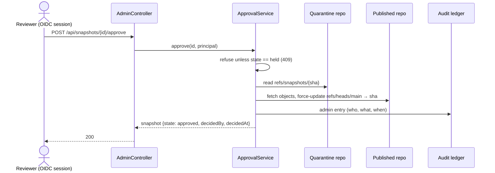
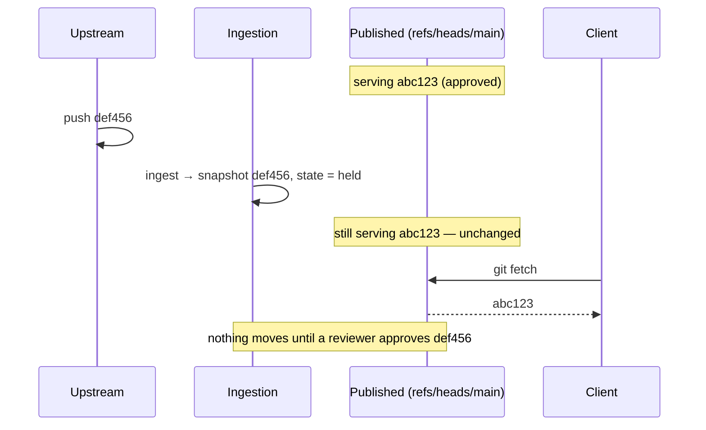

# Lifecycle — quarantine to serve

Every byte the gateway ever serves passes through three stages, in order. The
stages are separated by **storage**, not by a flag on a row: quarantined content
physically lives in a different git repository from published content.

This page is the product. Everything else is detail around it.

<!-- Diagram source of truth: docs/diagrams/lifecycle.mmd (Mermaid).
     The SVG pair below is generated from it with the diagram-design system —
     regenerate via .claude/skills/docs-diagrams whenever the .mmd changes. -->

--8<-- "docs/manual/assets/diagrams/lifecycle-light.svg"

--8<-- "docs/manual/assets/diagrams/lifecycle-dark.svg"

## The repositories

The gateway maintains bare git repositories per marketplace under
`skills-gateway.data-dir`:

| Repository | Path | Refs |
| --- | --- | --- |
| **Quarantine** | `{data-dir}/quarantine/{marketplace}.git` | One `refs/snapshots/{sha}` per ingested commit. **Never reachable through either endpoint.** |
| **Published** | `{data-dir}/published/{marketplace}.git` | Exactly one served ref, `refs/heads/main`. Created only by approval. |
| **Origin** *(hosted only)* | `{data-dir}/hosted/{marketplace}.git` | The publisher's own `refs/heads/main`, written by push and read only by ingestion. |

The facade resolves repositories through a method that opens only the published
path and returns nothing unless `refs/heads/main` resolves. There is no code
path from a facade request to the quarantine tree — nor from a
[publish](../guides/publishing-first-party-skills.md) request to either
quarantine or published: it resolves only the origin path, and only for a
marketplace the gateway hosts.

## Stage 1 — ingestion

Ingestion has three triggers, chosen per marketplace as its **sync mode**: an
operator's explicit call (`on-demand`, the default), the gateway's own polling
sweep (`scheduled`), or a signed forge push webhook (`webhook`). The trigger is
the only thing the mode changes — every path below runs identically whatever
pulled the commit in. See
[Syncing from upstream automatically](../guides/upstream-sync.md).

It clones the source's default branch with JGit (the gateway never shells out to
`git`), resolves the tip commit, and writes it into quarantine as
`refs/snapshots/{sha}`. The resulting snapshot starts in state `held`.

For a marketplace the gateway hosts there is no upstream: the source is its own
origin repository and the trigger is the publisher's push. Everything from the
snapshot pin onward — the manifest check, the vetting chain, the approval gate —
is the same code on the same content.

Registration has already constrained what can be ingested at all: the URL scheme
must be on the allowlist, and the ref is the gateway's decision, not the
registrant's. See [Trust boundaries](trust-boundaries.md).

Ingesting the same upstream commit twice does not create a second snapshot — the
snapshot is keyed by the upstream SHA, and the chain is not re-run for one that
already exists.

Once a snapshot is recorded as `held`, the **vetting chain** runs against the
content just pinned: each connector answers with a verdict, the verdicts are
recorded against the snapshot, and they aggregate fail-closed into a `clear` or
`blocked` outcome. The chain never changes the snapshot's state — a vetted
snapshot is still `held`. What it decides is whether approving it is an ordinary
act or one that needs a written reason. See
[Vetting — the connector chain](vetting.md).

## Stage 2 — approval

A held snapshot is inert. It is stored, it is inspectable in the portal, and it
is serving nothing.

Approval is gated by the chain: a snapshot whose *effective* outcome is blocked
— its latest run objects and some blocking finding is not covered by an active
waiver, which includes a snapshot the chain never ran against — is refused.
There is no override flag. The way past a finding is a scoped, justified,
expiring [waiver](../guides/waiving-findings.md) for it, and every waiver that
let an approval through is written to the ledger.

`ApprovalService.approve` is the **only** code in the system that publishes. It
fetches the pinned `refs/snapshots/{sha}` from quarantine into the published
repository and force-updates `refs/heads/main` to that exact SHA. Rejection
marks the snapshot `rejected` and touches no repository at all.

Both decisions record the deciding principal and timestamp and append to the
ledger. Both return **409 Conflict** on a snapshot that is already `approved` or
`rejected` — you cannot re-approve, and you cannot approve something already
rejected.

A `revoked` snapshot is the one exception, and it is decidable through these same
two endpoints. That is how content retracted by
[continuous re-vetting](../guides/re-vetting.md) comes back: the same gate, a new
reviewer, a new timestamp.

### Approval is not permanent

Publication holds until something takes it back, and one thing can:
[continuous re-vetting](../guides/re-vetting.md) re-runs the chain over approved
content on a schedule. If a run objects to the content and no active waiver
covers the finding, the violation is recorded and announced — and, when the
gateway is configured to enforce, the snapshot moves to `revoked` and its
published refs are removed.

That path only ever *unpublishes*. `ApprovalService.approve` remains the sole
publisher, which is why a revoked snapshot returns to being served only by going
back through it.

## Stage 3 — serving

The facade serves the published repository read-only over git smart-HTTP at
`/git/{marketplace}`, authenticated by personal access token. Clients see one
branch, `main`, pointing at the approved SHA.

See the [git smart-HTTP facade reference](../reference/git-facade.md) for the
wire protocol, authentication and the write-rejection guarantee.

One more repository rides on this stage without adding one to the lifecycle:
the [virtual catalog](../guides/virtual-catalog.md) is *derived* content —
re-synthesized from what every published repository is serving whenever an
approval or revocation changes that set. It introduces no new state and no new
way in; it is a view over stage 3, never a bypass of stage 2.

## Why upstream movement is safe

This is the property the whole design exists to provide.

A new upstream commit produces a new **held** snapshot. It does not touch the
published ref. Clients keep receiving the previously approved SHA until — and
only until — a human approves the new one. If the new snapshot is rejected, the
old one keeps serving indefinitely.

That is the difference between a mirror and a gateway: a mirror propagates
whatever upstream did, and a gateway requires a decision.
