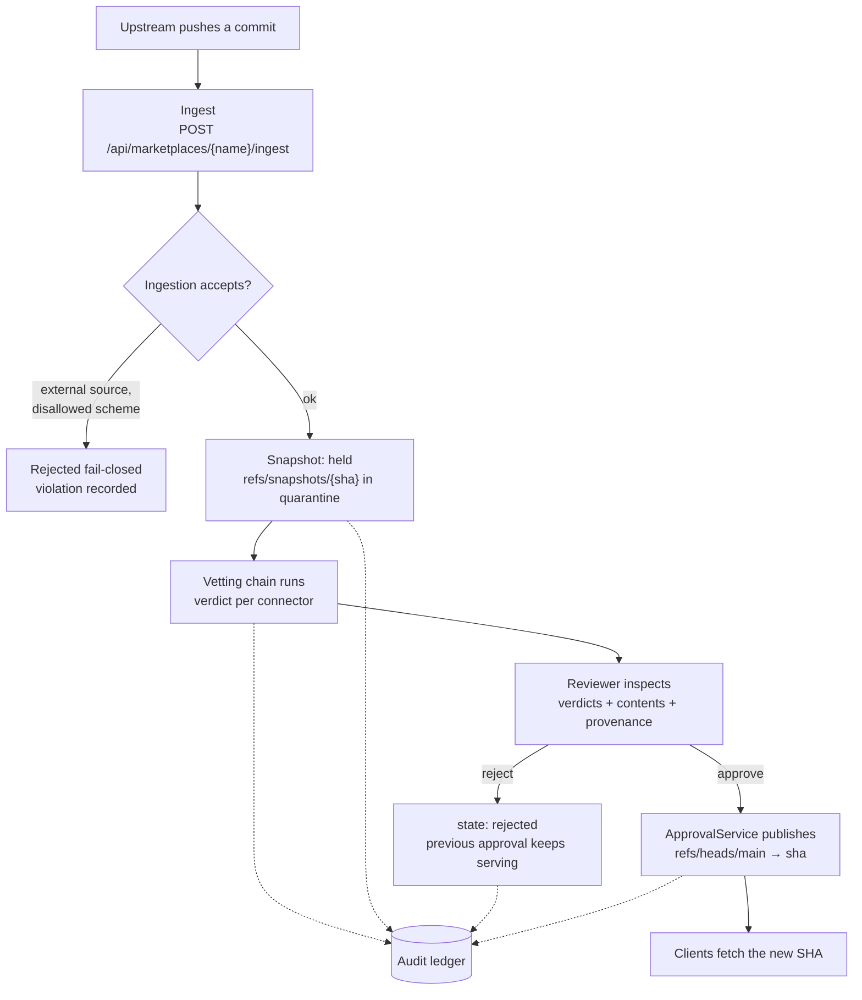
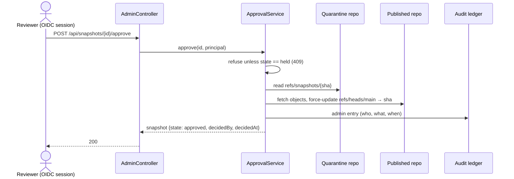
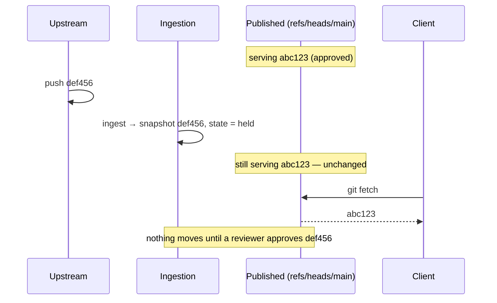

# Lifecycle — quarantine to serve

Every byte the gateway ever serves passes through three stages, in order. The
stages are separated by **storage**, not by a flag on a row: quarantined content
physically lives in a different git repository from published content.

This page is the product. Everything else is detail around it.

## The two repositories

The gateway maintains two bare git repositories per marketplace under
`skills-gateway.data-dir`:

| Repository | Path | Refs |
| --- | --- | --- |
| **Quarantine** | `{data-dir}/quarantine/{marketplace}.git` | One `refs/snapshots/{sha}` per ingested commit. **Never reachable through the facade.** |
| **Published** | `{data-dir}/published/{marketplace}.git` | Exactly one served ref, `refs/heads/main`. Created only by approval. |

The facade resolves repositories through a method that opens only the published
path and returns nothing unless `refs/heads/main` resolves. There is no code
path from a facade request to the quarantine tree.

## Stage 1 — ingestion

Ingestion is explicit. There is no upstream watcher in the current scope:
something outside the gateway — a cron job, a CI schedule, a forge webhook
calling the endpoint — decides when to look for new commits.

It clones the upstream default branch with JGit (the gateway never shells out to
`git`), resolves the tip commit, and writes it into quarantine as
`refs/snapshots/{sha}`. The resulting snapshot starts in state `held`.

Registration has already constrained what can be ingested at all: the URL scheme
must be on the allowlist, and the ref is the gateway's decision, not the
registrant's. See [Trust boundaries](trust-boundaries.md).

Ingesting the same upstream commit twice does not create a second snapshot — the
snapshot is keyed by the upstream SHA, and the chain is not re-run for one that
already exists.

Once a snapshot is recorded as `held`, the **vetting chain** runs against the
content just pinned: each connector answers with a verdict, the verdicts are
recorded against the snapshot, and they aggregate fail-closed into a `clear` or
`blocked` outcome. The chain never changes the snapshot's state — a vetted
snapshot is still `held`. What it decides is whether approving it is an ordinary
act or one that needs a written reason. See
[Vetting — the connector chain](vetting.md).

## Stage 2 — approval

A held snapshot is inert. It is stored, it is inspectable in the portal, and it
is serving nothing.

Approval is gated by the chain: a snapshot whose latest run is `blocked` — which
includes one the chain never ran against — is refused unless the reviewer
supplies an override reason, recorded against the run and in the ledger.

`ApprovalService.approve` is the **only** code in the system that publishes. It
fetches the pinned `refs/snapshots/{sha}` from quarantine into the published
repository and force-updates `refs/heads/main` to that exact SHA. Rejection
marks the snapshot `rejected` and touches no repository at all.

Both decisions record the deciding principal and timestamp and append to the
ledger. Both return **409 Conflict** on a snapshot that is not `held` — you
cannot re-approve, and you cannot approve something already rejected.

## Stage 3 — serving

The facade serves the published repository read-only over git smart-HTTP at
`/git/{marketplace}`, authenticated by personal access token. Clients see one
branch, `main`, pointing at the approved SHA.

See the [git smart-HTTP facade reference](../reference/git-facade.md) for the
wire protocol, authentication and the write-rejection guarantee.

## Why upstream movement is safe

This is the property the whole design exists to provide.

A new upstream commit produces a new **held** snapshot. It does not touch the
published ref. Clients keep receiving the previously approved SHA until — and
only until — a human approves the new one. If the new snapshot is rejected, the
old one keeps serving indefinitely.

That is the difference between a mirror and a gateway: a mirror propagates
whatever upstream did, and a gateway requires a decision.
