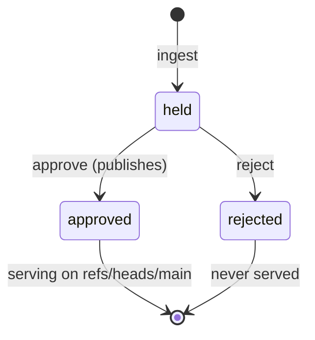

# Snapshots and the audit ledger

Two objects carry the product's guarantees: the **snapshot**, which makes
content immutable and attributable, and the **ledger**, which makes access
answerable.

## Marketplace

A *marketplace* is a registered upstream git repository — a name, a clone URL,
and best-effort forge metadata (forge, project, description, last upstream
update) captured at registration.

The name must match `^[a-z0-9][a-z0-9_-]*$`. It is the identity of the
marketplace everywhere: the portal route, the API path, and the facade URL
`/git/{name}`.

Registration does **not** fetch anything. It only establishes that this URL is
one the gateway is willing to talk to.

## Snapshot

A *snapshot* is one upstream commit, captured at one moment, with a vetting
decision attached. It is the unit of review, approval, serving, audit and
retention.

| Field | Meaning |
| --- | --- |
| `sha` | The 40-hex upstream commit. This is the pin. |
| `state` | `held`, `approved`, or `rejected`. Set at ingestion and changed exactly once by a decision. |
| `violation` | Why ingestion flagged the snapshot, when it did. |
| `decidedBy` / `decidedAt` | The principal who decided, and when. |
| `createdAt` | When the gateway ingested it. |

The state machine is deliberately tiny and one-way. There is no revocation
state, and re-deciding is refused with 409.

### Why SHA pinning is the point

Git refs are mutable; commit SHAs are not. Everything the gateway stores and
serves is keyed by the upstream SHA:

- Quarantine holds `refs/snapshots/{sha}` — one immutable ref per ingested
  commit.
- Approval force-updates the published `refs/heads/main` to *that exact SHA*.
  The published ref moves only because a human approved a specific commit.
- The ledger records the SHA on every fetch.

The consequence: "what exactly ran on that laptop" reduces to a ledger lookup,
and an upstream force-push cannot change the answer retroactively.

### What a snapshot contains

`GET /api/snapshots/{id}/content` parses the captured commit and lists what it
declares: each plugin with its name, `source` and description, and the skills
found under each.

This is the review surface, and it works on `held` snapshots — reviewing a
snapshot must not require serving it.

## The audit ledger

The ledger is one PostgreSQL table, `fetch_log`, and it is **append-only**: no
code path in the product issues an `UPDATE` or `DELETE` against it. Retention
does not compact it. That is what makes it usable as compliance evidence rather
than as an operational log.

| Column | Meaning |
| --- | --- |
| `id` | `BIGSERIAL`. The ordering key. |
| `ts` | When the entry was appended. |
| `source` | The client address for a fetch; the literal `admin` for an administrative action. |
| `principal` | The PAT principal for a fetch, the OIDC principal for an admin action. |
| `marketplace` | The marketplace name, or `-` when not marketplace-scoped. |
| `event` | What happened. |
| `ref` | The ref involved, when there is one. |
| `sha` | The commit involved, when there is one. |

### What gets recorded

**Facade fetches** — `info-refs` when a client asks what refs exist, carrying
the resolved `main` SHA; and one `upload-pack` entry per wanted object when the
packfile is served. Negotiation rounds are not recorded.

**Administrative actions** — registration, ingestion, approve and reject, each
carrying the acting OIDC principal.

### Reading it

`GET /api/audit` returns the whole table, and the portal's
[Audit log page](../reference/portal.md#audit-log) renders it. There is no
filtering, search or paging: it is a recent-activity view.

Because entries carry the principal, marketplace and SHA, the inventory question
— "every identity that fetched this exact content" — is a single query against
the ledger.

### What the ledger is not

- Not hash-chained — there is no tamper-evidence beyond the append-only
  discipline of the code and your database controls.
- Not itself retained or archived by the product. How long you keep it is your
  compliance decision.
- Not yet streamed anywhere. Continuous export to a SIEM is a separate
  capability.

## Current scope limits

Both limits are enforced, not merely documented:

**Local sources only.** Plugins must live inside the marketplace repository as
relative paths. External source types are rejected fail-closed at ingestion,
which removes transitive resolution and source rewriting from the current scope
entirely.

**Default branch only.** Registration accepts no ref other than `main`. Serving
additional refs is a future feature, implemented as promotion per
`(upstream, ref)`, with each ref advancing independently through the same gate.
