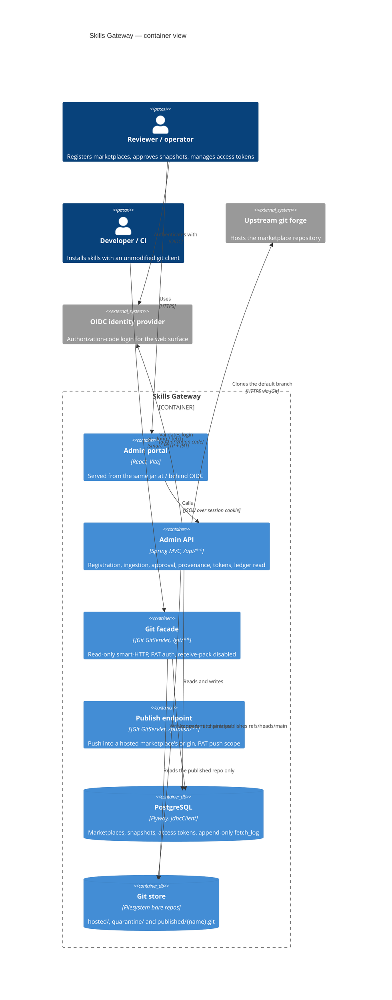
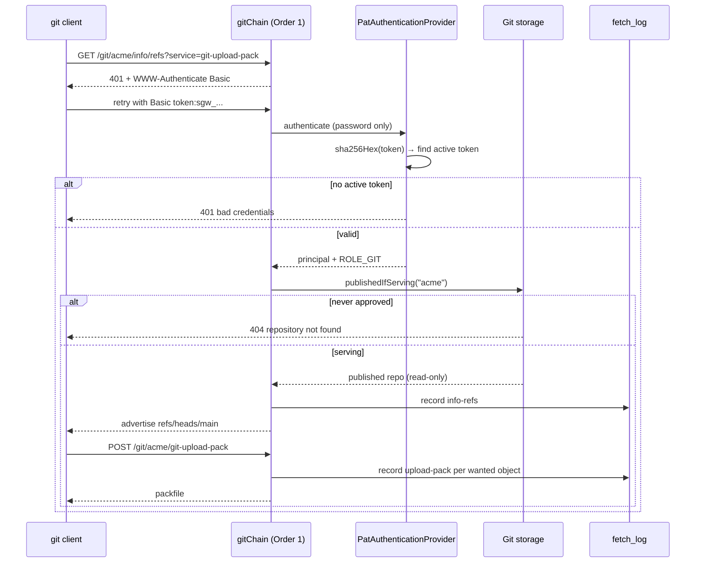

# Trust boundaries

Three boundaries carry the security weight of the system. Everything else is
plumbing.

!!! danger "Changes here need adversarial tests"

    A change touching facade authentication, `ApprovalService`, or the
    registration allowlist should ship with negative tests — rejected schemes,
    revoked tokens, quarantine unreachability, push attempts — not only
    happy-path coverage.

## Container view

## 1. Registration — an operator's URL becomes an outbound fetch

Registering a marketplace hands the gateway a URL it will later clone. Two gates
apply before the row is written.

**URL scheme allowlist.** The URL is parsed and its scheme lower-cased and
matched against `skills-gateway.allowed-url-schemes` (default `http`, `https`).
Anything else — `file:`, `ssh:`, `ext:`, and any URL that fails to parse or
carries no scheme at all — is rejected **fail-closed** with 400. The same check
guards every operator-supplied outbound URL in the product.

**Gateway-pinned ref.** The `ref` field must be absent or exactly `main`. Which
ref gets ingested is the gateway's decision, not the registrant's. Multi-ref
publication is a designed future feature and will arrive as promotion per
`(upstream, ref)` — not by relaxing this check.

Marketplace names are additionally constrained to `^[a-z0-9][a-z0-9_-]*$`, which
is also what makes them safe as path segments on the facade.

See [Compatibility and allowlists](../reference/compatibility.md) for the full
matrix.

**Declared marketplaces enter through the same gate.** The
[declarative estate block](../reference/configuration.md#declarative-estate)
is a second *caller* of this boundary, never a second implementation: a
declared marketplace faces the same name rules, reserved name and scheme
allowlist as an API registration, has no ref key to declare, and a failing
entry is reported rather than registered. Reconciliation is additive — the
declaration can create and converge, never deregister.

## 2. The facade — an anonymous network peer becomes a reader

`/git/**` is served by its own Spring Security filter chain, ordered ahead of
the web chain, and it is **stateless**:

- HTTP Basic, with a provider manager whose only provider is the PAT provider.
  An OIDC browser session can never authenticate a git fetch, because no OIDC
  provider exists in that chain.
- Only the password field is read; the username is ignored (`token` by
  convention). This is what makes the standard git credential helper work
  unmodified.
- Tokens are `sgw_` + Base64url of 32 random bytes. Only an unsalted SHA-256 hex
  digest is stored, and the cleartext is returned exactly once. Unsalted is
  deliberate — these are high-entropy random tokens, not user-chosen passwords.
- A token may be **scoped** to named marketplaces (GW_0064) and may **expire**
  (GW_0065). Both are enforced where they matter: expiry at authentication (an
  expired token is refused exactly like a revoked one, by comparison, with no
  sweep), scope in the facade resolver — an out-of-scope request gets the same
  not-found a nonexistent marketplace gets, so a scoped token cannot probe what
  else the gateway governs.
- Every fetch entry on the ledger names the token that authenticated it
  (GW_0067), not just the principal: a principal with several tokens is several
  distinct credentials — and says whether that credential was derived from a
  browser session (GW_0104) or deliberately provisioned, which is a different
  question from who held it.
- Receive-pack is disabled by construction on this endpoint, so there is no
  write path here to reject at runtime. Publication into a gateway-hosted
  marketplace is a separate boundary — see below.

!!! note "The facade chain is unconditional"

    The `dev-insecure-auth` escape hatch does not touch it. `/git/**` requires a
    valid PAT even in development mode.

## 3. Approval — held content becomes served content

`ApprovalService` is the only publisher. The invariant is structural rather than
procedural: nothing else in the codebase writes to `{data-dir}/published/`, and
the facade reads nothing else.

An `approved` or `rejected` snapshot cannot be decided again, so the published
ref only ever advances through a deliberate, recorded decision.

It can also *retreat*, and only one thing makes it: an enforced
[re-vetting](../guides/re-vetting.md) violation, which removes the published
refs and moves the snapshot to `revoked`. That path never publishes — it only
unpublishes — so `ApprovalService` remains the sole publisher, and a revoked
snapshot returns to being served only by going back through it.

Gates precede every publication, inside that single publisher and before any
state transition: the fail-closed [vetting gate](vetting.md) (evidence about the
content, waivable finding by finding), then the fail-closed
[policy gate](../guides/policy-rules.md) (standing organizational deny rules,
not waivable — the exception path is editing the rule, audited), then the
cooling-off window, and last the
[four-eyes rule](../guides/approving-snapshots.md#separation-of-duties). A
refusal by any of them leaves the snapshot held and publishes nothing.

The last one guards a different property from the others, and it is the property
the whole boundary rests on. Vetting and policy ask *is this content
acceptable*; four-eyes asks *is this decision an independent one* — whether the
reviewer is the marketplace's registrant, the snapshot's ingestion actor, or the
author of a waiver the approval leans on. Without it, one identity could carry
content from an upstream URL all the way to the facade unaccompanied, and every
recorded decision on the way would still look correct.

It is the one gate whose strictness is a deployment decision rather than a
constant. Under the default `warn` the conflict is recorded on the ledger and
the approval proceeds — a deployment with a single administrator has no second
pair of eyes to offer, and refusing there would only make the gateway
unapprovable; under `enforce` the approval is refused. What has no off switch is
the *detection*: a self-approval is on the ledger either way, which is what
keeps `warn` a measurement rather than a blind spot. The automated sync triggers
are not identities and never conflict.

None of these gates can ever *open* on their own: none can approve. Policy rules
in particular cannot auto-approve, because that would delegate the human decision
this boundary exists to guarantee to an expression — a trust-model change,
decided deliberately or not at all (ADR 0006 in
[Architecture decisions](../reference/decisions.md)).

What *a human* can do, deliberately and audibly, is the airline-cockpit escape
hatch (ADR 0009): an **administrator** can disconnect the automation. Two acts,
both admin-only and both on the ledger. An administrator can **override** a
blocked outcome on approve, by stating a reason — the override lifts only the
vetting gate, leaving policy, cooling-off and four-eyes in force, and writes a
distinct `snapshot-approved-over-vetting-failure` event plus a standing marker so
the served snapshot is never indistinguishable from a clean approval. An
administrator can also **disable a connector**, globally or per marketplace — but
the disablement is recorded as a `disabled` verdict on every run, and a run with
nothing but disabled verdicts stays *blocked*, so switching the chain off is
never a way to clear content. The override is the rarer, whole-outcome
counterpart to a scoped, expiring waiver; neither is a silent bypass.

## The web surface

Everything that is not `/git/**` is the web chain: OIDC authorization-code login
only, with the application acting as its own BFF. The browser never holds a
token; the session cookie is its only credential. `/actuator/health` is the sole
unauthenticated path.

Requests to `/api/**` that lack a session get a clean **401** rather than a 302
to the identity provider, so an expired session surfaces in the SPA as an error
instead of an HTML login page rendered into a `fetch()`.

!!! warning "dev-insecure-auth"

    `skills-gateway.dev-insecure-auth=true` makes the **entire web surface**
    unauthenticated and injects a synthetic principal `dev`. It exists for local
    development, logs a loud warning at startup, and must never be set in a
    deployed environment. See [Local development](../guides/local-development.md).

    Being off by default is the control; the second one is a startup guard. A
    gateway that has an identity provider configured and this flag on **refuses
    to start**, because the login it configured is the login the flag switches
    off. See [Configuration](../reference/configuration.md).

    It opens the **browser** surface only. A request carrying an
    `Authorization: Bearer` header is authenticated strictly even in this mode,
    the way the git facade is: a mode in which every bearer value authenticated
    would be a very quiet way to lose the control plane in a copied
    configuration.

## The machine API — a credential in a pipeline becomes a control-plane caller

`/api/**` has a second entrance, taken by a request that carries an
`Authorization: Bearer` header. It is a sibling of the git facade's chain rather
than a mode on the web chain: stateless, no session created, no cookie honoured,
and a request presenting both a bearer credential and a cookie is refused rather
than resolved to either.

**Authentication** is a machine API credential — an access token whose API scope
list is non-empty. That non-emptiness is a *precondition of authentication*, not
a later authorization rule, so no controller can be the single point of failure.
A perfectly valid personal access token — including the every-marketplace form,
the most permissive fetch grant the system has — does not authenticate here at
all.

**The guarantee is symmetric.** A credential holding API scopes reaches no
marketplace through the facade and no marketplace through publication, *including
the marketplaces its empty fetch scope list would otherwise grant*: the fetch
default is conditional on the credential's shape.

**Authorization** is an allowlist over per-concern named scopes, enforced in the
filter chain and therefore independent of the session chain's role checks.
Reach is the intersection of the allowlist, the credential's scopes and its
principal's roles — never their union. Every act of human judgement, every
operation that retracts or republishes content, every role grant and the whole
of `/api/tokens/**` sits outside the allowlist, and no combination of scopes and
no role reaches them. An endpoint added later is unreachable until somebody
names it; a build-time check refuses an unclassified one.

**Attribution.** Every ledger entry now carries an explicit actor type —
`human`, `machine` or `system` — beside the identity it names, denormalised so a
row written years ago still says what it meant after the credential it names has
been revoked and its row deleted. That replaces an implicit vocabulary in which
`config-reconciler`, `scheduler` and `system` were magic strings in the identity
column. A machine entry also carries the credential's id, so a leak trace has
per-credential resolution.

See [Access tokens](../reference/api/tokens.md#machine-api-credentials).

## 4. The inbound webhook — a forge's push event becomes a fetch

`POST /hooks/{marketplace}` is the one endpoint reachable without an OIDC
session or a PAT, so its authentication is cryptographic and its authority is
deliberately nil. Authentication: an HMAC-SHA256 signature of the exact raw
request body (GitHub-compatible `X-Hub-Signature-256`), verified in constant
time against a per-marketplace secret the gateway generated and returned
exactly once. Authority: the payload is never read — a valid signature only
triggers ingestion of the **registered** upstream URL's default branch, which
lands `held` in quarantine exactly as the polling sweep would have produced.

The worst a forged-but-signed request can cause is therefore a redundant fetch
of content the gateway already governs; nothing on this path can name a URL, a
ref, or a commit, and nothing on it can approve or publish. Body size is
bounded before the HMAC is computed, and requests for marketplaces not in
webhook mode are refused without revealing why.

## 5. Publication — a publisher's push becomes quarantined content

A marketplace the gateway
[hosts itself](../guides/publishing-first-party-skills.md) has no upstream: its
content arrives by `git push` to `/publish/{name}`. That is the only write path
the gateway has, and four things keep it from being a way around the rest of
this page.

**It is somewhere else.** A separate servlet, resolving a separate repository,
behind a separate filter chain. `/git/**` keeps its null receive-pack factory,
so no push can reach a published repository — not by misconfiguration, because
there is no shared object to misconfigure ([ADR 0007](../reference/decisions.md)).

**It writes to neither quarantine nor published.** A push lands in the
marketplace's *origin* repository. Ingestion then fetches out of it into
quarantine exactly as it fetches from an upstream URL, so quarantine keeps the
property that only the ingestion service writes it — and the
`refs/snapshots/<sha>` namespace that vetting and approval address content by
stays out of any external credential's reach.

**The credential is one nobody holds.** Push authority is a token scope
separate from fetch scopes, and where an absent *fetch* scope means every
marketplace (the compatibility rule for tokens predating scoping), an absent
*push* scope means none. No token issued before this existed can publish, and
no token can be granted publication to everything by omission. A push for a
marketplace outside the scope answers exactly as one for a marketplace that
does not exist.

**A publisher may move one lineage, forward.** Only `refs/heads/main` may be
updated; no ref may be deleted; history may not be rewritten unless the
marketplace was registered saying it may — and when it may, both tips land on
the ledger, so "the lineage under that approved snapshot was rewritten" stays
answerable.

What a push does **not** do is shorten the pipeline. The commit is quarantined,
manifest-checked, vetted and held like anything fetched, and is served only
after a human approves it. First-party content removes a redundant system, not
the review.

## 6. Roles — what an authenticated session may do

Authentication says who a session is; the role model says what it may do.
Three roles, enforced at the REST API by an explicit authorization call at the
top of every privileged endpoint:

| Role | Scope | Authority |
| --- | --- | --- |
| `admin` | global | Every operation, including managing grants. |
| `approver` | one marketplace | Ingest, approve, reject, re-vet, waive — for that marketplace only. The owning marketplace is resolved from the addressed snapshot or waiver on the server side, so a bare id cannot reach another marketplace's content. |
| `auditor` | global | Read the ledger, its export, the operational listings. No mutations. |

Enforcement is **deny-by-default and unconditional**: a session with no role
keeps the browsing surface and its own tokens, and is refused everything else.
There is no configuration that turns it off. A deployment that locks itself out
is prevented at the other end instead — the gateway refuses to start unless its
configuration grants the admin role to somebody, and principals in
`skills-gateway.roles.admins` are admins by configuration and cannot be revoked
through the API. Every grant and
revocation is on the append-only ledger.

A role can come from three places, and the union is what a session holds: the
`skills-gateway.roles.admins` list, a grant row, or a **claim** of the identity
provider's token mapped by `skills-gateway.roles.mappings`. Claim mapping moves
part of this boundary into the directory — deliberately, because that is where
membership is already governed — under three rules that keep it from widening
it. Values are matched exactly, so a mapping cannot grant by resemblance. A
malformed mapping refuses startup, so a typo cannot quietly grant nothing.
And claims are read only from a session established through the identity
provider: a PAT, the `dev-insecure-auth` principal and the anonymous webhook
request carry no claims and derive no role, whatever authorities they hold.

The identity token's own integrity is part of this: the gateway configures its
provider endpoints explicitly rather than by discovery, so it compares the
token's issuer only when `skills-gateway.oidc.issuer` names one. Where a single
authorization endpoint serves many tenants, that comparison *is* the tenant
boundary — every tenant's tokens verify against the same keys.

This boundary is the web surface's only. The facade's authorization is
[token scopes](../reference/api/tokens.md) — a different credential for a
different surface — and roles never apply to PATs. See
[Delegated administration](../guides/delegated-administration.md) for the
workflow, [Identity providers](../guides/identity-providers.md) for claim
mapping, and [Roles](../reference/api/roles.md) for the grants API.

## The storage itself

Publication is a reference transition on the published repository, and the
boundary is therefore wherever those references physically live.

On the `filesystem` backend that is the mounted volume: anyone who can write to
it can move `refs/heads/main` without `ApprovalService` ever running. That has
always been true, and it is why the volume inherits the encryption and access
expectations of the content it holds.

On the `object-store` backend it is the bucket. The served reference map is one
small object; **anyone who can write that object can put content on the wire
without approval**, and can do it from outside the gateway entirely. The
mitigation is a narrow bucket policy — object read, write and delete under the
gateway's own prefix, no bucket administration — and treating the bucket as the
same kind of asset the volume was.

The gateway cannot enforce this. It has no way to distinguish its own write from
anyone else's, and no way to detect one that already happened. What it does do
is refuse to start against a store whose conditional writes are not faithful, so
that its *own* concurrent writers cannot lose a transition. That is a different
guarantee, and it is not a substitute for the policy.

## What is not a boundary yet

A **second recorded approval** — a queue in which two identities each decide,
rather than one deciding while the gateway checks who they are — is not
implemented. The four-eyes rule refuses a conflicted approval; it does not
require two approvals of an unconflicted one.

Per-team catalog scoping (which identities see which virtual marketplaces) and
a portal UI for managing grants are future capabilities; today the grants API
and the claim mappings are the management surface. Where the role model is not enabled, treat **access
to the portal** as the reviewer privilege and grant it through the identity
provider.
