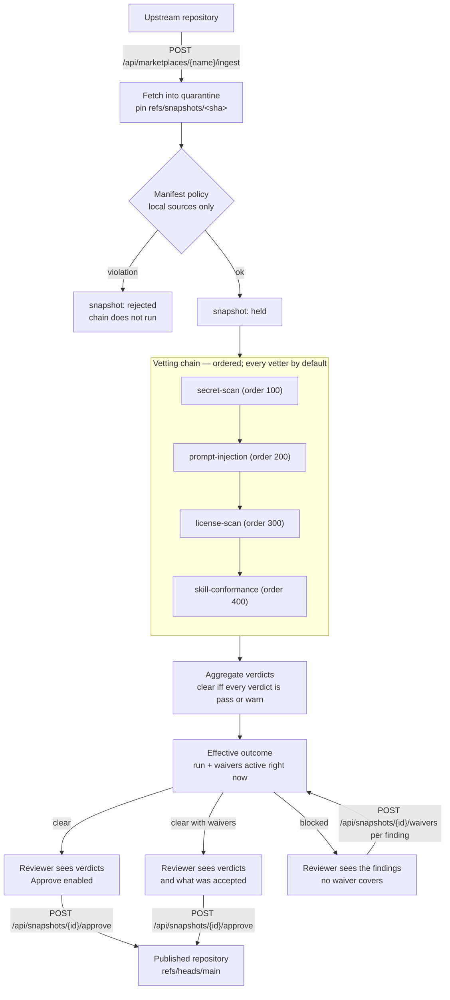

# Vetting — the vetter chain

Every snapshot the gateway ingests is quarantined and pinned to an upstream
commit SHA. Between that pin and the reviewer's decision the gateway runs a
**vetting chain**: an ordered list of vetters, each of which looks at the
snapshot's content and answers with a verdict. The verdicts and their findings
are recorded against the snapshot and shown to the reviewer before any approve
or reject decision.

The gateway does not vet content itself. It orchestrates: it runs vetters,
normalises what they answer, records it, and aggregates it into a single
outcome that gates approval.

## Where the chain sits

The chain never changes the snapshot's own state. A vetted snapshot is still
`held`; what the chain decides is whether approving it is an ordinary act or one
that has to be justified in writing.

That separation is what lets the same chain run again, later, over a snapshot
that is already approved and served — a new run against unchanged state. What
such a run *means* is a separate judgement, described in
[Re-vetting approved content](../guides/re-vetting.md): only a vetter that
objects to the content can retract it, and a vetter that merely broke never
can.

## The vetter contract

A vetter has a stable name, a position in the chain, and one method that
takes the snapshot and returns a verdict. What it is given is deliberately
narrow: the snapshot's id, its marketplace, its commit SHA, and a walk over the
files in that commit. It is not given a repository handle, so a vetter cannot
move a ref, write to quarantine, or read another marketplace's content.

The walk takes the vetter's own selection of paths, and content is read only
for the files that selection asks for. One chain run walks the commit's tree
once and reads each selected file once however many vetters want it, so
`license-scan` reading two file kinds no longer costs a full pass over the tree.
What a vetter sees is unchanged by this: a file over the size limit is still
handed over unread rather than omitted. How much content a run keeps for that
reuse is bounded by
[`skills-gateway.vetting.content-cache-bytes`](../reference/configuration.md#vetting);
beyond the bound content is read again rather than kept, so the setting costs
speed and never coverage.

A verdict carries a state, an optional external report URL, and a list of
findings. A finding has a **stable rule id** (`aws-access-key-id`), a severity,
a location (normally `path:line`), and a reviewer-facing message. The rule id is
the identity a [scoped waiver](#waivers-accepted-risks-with-a-scope-and-an-expiry)
is written against, so it is part of the contract rather than a display string.

### Verdict states

| State | Meaning | Blocks approval |
| --- | --- | --- |
| `PASS` | The vetter found nothing. | No |
| `WARN` | Something worth showing the reviewer that does not block. | No |
| `FAIL` | Something that blocks. | Yes |
| `ERROR` | The vetter produced no verdict: it threw, or it exceeded its time limit. | Yes |
| `PENDING` | The vetter was triggered and has not answered yet. | Yes |
| `DISABLED` | An administrator switched the vetter off for this marketplace, so the chain did not run it. | No — and it does not clear either |
| `NOT_REACHED` | The chain stopped before this vetter, so it was not run. | No — and it does not clear either, but see below |

A vetter does not choose its state directly: it emits findings, and the
verdict follows the worst severity present — `HIGH` or `CRITICAL` fails,
`LOW` or `MEDIUM` warns, and `INFO` alone still passes. That way a new rule only
has to get its severity right.

`PENDING` exists so that an asynchronous vetter — one that is triggered over
a webhook and answers later — fits without changing the gate. No built-in
vetter returns it; a configured [external connector](#external-connectors)
that answers `pending` does, and it blocks until it is resolved.

### Switching a vetter off

An administrator can disable a vetter globally or for one marketplace. A
disabled vetter is not run at ingestion or re-vetting; the chain records a
`DISABLED` verdict in its place, so the disablement is part of the run's
evidence rather than a silently shorter chain. Because `DISABLED` never clears,
disabling every vetter leaves a run blocked — the switch is not a blanket
approval. The settings, the audit events and the endpoints are in
[the API reference](../reference/api/marketplaces.md#vetter-enabledisable).

### Stopping the chain after a failure

By default the chain runs every enabled vetter, whatever the ones before it
concluded. An administrator can change that for one marketplace, or globally:

| Chain mode | What it does |
| --- | --- |
| `run-all` | Every enabled vetter runs. The default. |
| `stop-after-fail` | The chain stops after the first vetter whose verdict still objects to the content, and the vetters after it are recorded `NOT_REACHED`. |

What it buys is real: an expensive vetter — one billed per call, or one that
detonates the snapshot in a sandbox — is not spent on content a cheap
deterministic scan has already condemned, and that cost is otherwise paid again
on every [re-vetting](../guides/re-vetting.md) pass over the whole approved
estate.

**What it costs a reviewer** is equally real, and is the reason it is off by
default. A run that stopped early is not a shorter description of the same
answer; it is a smaller answer. The reviewer no longer sees everything that is
wrong with a snapshot in one pass, so a fix-and-re-ingest loop can take several
rounds, each revealing one more objection. Under `run-all` a run's verdict set is
complete by construction; under `stop-after-fail` it is not, and the portal says
so above the chain.

Three properties keep a shorter run from becoming a cleaner one:

- **Nothing is omitted.** Every vetter of the chain still has a verdict. A
  vetter that was not reached says so, and says which vetter stopped the chain.
- **`NOT_REACHED` never clears.** Like `DISABLED` it is an absence rather than a
  conclusion, and the aggregation still requires at least one clearing verdict.
- **A run that stopped early is blocked, whatever is waived.** This is the one
  that matters. Accepting the finding that stopped the chain does *not* clear the
  run — the vetters behind it never looked at the content, and a gate opened on
  their silence would be indistinguishable from a gate opened on a clean chain. A
  waiver makes the **next** run get further; the run that stopped stays blocked
  until the chain has been run again. Re-vet the snapshot, and the gate is then
  decided on complete evidence.

Only a `FAIL` stops the chain — not an `ERROR`, which is a fact about the
gateway rather than about the content, and not a `PENDING`, which has concluded
nothing. And only a `FAIL` that a reviewer has not already accepted: a verdict
whose findings are all waived does not condemn the snapshot, so the chain runs
on past it.

Changing the mode is an administrator-only, audited act, like the on/off switch.
The endpoints are in
[the API reference](../reference/api/marketplaces.md#chain-mode-and-vetter-order).

### The order the vetters run in

Order only becomes a control once the chain can stop: under `run-all` it decides
nothing but the sequence of the run and the left-to-right position in the
portal's chain flow. Under `stop-after-fail` it decides which vetters get to look
at all, so the cheap and deterministic ones belong first.

An administrator can set the order globally or for one marketplace. The
arrangement need not name every vetter. The **resolved** order is:

1. the vetters the arrangement names, in the order it names them;
2. then every vetter it does not name, by its configured position, with ties
   broken by the vetter's name.

That rule is total and deterministic, so a recorded run is reproducible, and an
arrangement can never drop a vetter by omission — including a vetter a later
release of the gateway adds, or an [external
connector](#external-connectors) an operator configures afterwards. An
arrangement naming a vetter that does not exist, or naming one twice, is refused
rather than stored.

### How the settings resolve

Both settings resolve the same way the
[vetter on/off switch](#switching-a-vetter-off) does: the setting scoped to the
marketplace when there is one, otherwise the global setting, otherwise the
default. The administrative surface reports which of the three decided, so a
default is never mistaken for a decision somebody made.

Both are recorded with every run, in the run's **chain identity**, alongside each
vetter's rule-set version — `secret-scan@3,prompt-injection@1;mode=run-all`. That
is what keeps [re-vetting](../guides/re-vetting.md) able to answer its own
question: when a snapshot that cleared last month is blocked today, was it the
content that changed, or the chain?

## Fail-closed aggregation

A chain run is **clear** if and only if it produced at least one clearing
verdict and every verdict is `PASS`, `WARN`, `DISABLED` or `NOT_REACHED`.
Everything else is **blocked**:

- any vetter that failed;
- any vetter that crashed or timed out — a crash is a blocked snapshot, never
  a skipped vetter;
- any vetter that has not answered;
- **and a snapshot with no chain run at all.**

That last case is the one that matters most. A snapshot ingested before the
chain existed, or one whose run died halfway, is blocked — absence of evidence
is not evidence of safety.

- **and a run that stopped early**, however its verdicts aggregate and whatever
  waivers are active: the vetters it did not reach have said nothing either way,
  so the run is missing evidence rather than merely missing an objection.

By default all vetters run, in order, and the chain does not stop at the first
failure, because a reviewer should see everything that is wrong with a snapshot
at once. An administrator can trade that away per marketplace — see
[Stopping the chain after a failure](#stopping-the-chain-after-a-failure).

## The approval gate

`POST /api/snapshots/{id}/approve` takes no request body. It refuses a snapshot
whose **effective** outcome is blocked, with `409` and a problem document naming
both the blocking vetters and — in `uncoveredFindings` — every blocking
finding that no active waiver covers. That array is the reviewer's worklist: it
is exactly the set of waivers that must exist for the approval to succeed.

**A reviewer has no override.** The only way a reviewer gets past objecting
vetters is to accept each blocking finding individually with a
[waiver](#waivers-accepted-risks-with-a-scope-and-an-expiry).

An **administrator** — and only an administrator — can approve a blocked
snapshot outright, by supplying a mandatory reason. The override lifts only the
vetting block: the policy, minimum-release-age and four-eyes gates still decide,
and it lands on the ledger as its own event, so it is never indistinguishable
from an approval the chain cleared. See
[Administrative override of a blocked outcome](../reference/api/marketplaces.md#administrative-override-of-a-blocked-outcome).

### Not a vetter: the minimum release age

The same gate carries one precondition the chain has nothing to do with. When
[`minimum-release-age`](../reference/configuration.md#minimum-release-age) is
configured, a snapshot the gateway ingested less than that long ago cannot be
approved however clear its verdicts are — a cooling-off window that gives the
world time to notice a compromised release before this gateway adopts it.

It is deliberately not a vetter. A verdict is evidence about content at the
moment it was gathered; "too young" is a fact about now. Recorded as a failing
verdict it would keep blocking after the age had passed, until some later
re-vetting run happened to replace it. Checked at the approval request instead,
it clears itself and leaves nothing behind — the same reasoning that makes
waiver expiry a comparison rather than a state.

## Waivers: accepted risks with a scope and an expiry

A **waiver** is an accepted-risk exception for **one finding rule**, on **one
marketplace**, within **one scope**, until **one date**. All four are mandatory,
and so are a justification and the identity accepting the risk. There is no way
to express an unlimited waiver — `expires_at` is `NOT NULL` in the schema, and a
past expiry is refused at creation.

| Scope | The scope value is | It covers a finding when |
| --- | --- | --- |
| `SNAPSHOT` | the snapshot's commit SHA | the finding is on that exact commit |
| `PATH` | a repository-relative path | the finding's path is that path, or lies under it |

Scope is matched against the **path part** of a finding's location, never the
line number: inserting a line above a finding moves the number, and a waiver
that evaporates on an unrelated edit trains reviewers to re-waive without
reading. Path matching is a prefix on a segment boundary — `plugins/a` covers
`plugins/a/x.md` but never `plugins/ab.md` — and there is no glob syntax.

`SNAPSHOT` scope is the tighter of the two and is what the portal offers first:
it dies with the SHA, so the next ingestion blocks again and the acceptance has
to be made deliberately a second time. A `PATH` waiver survives re-ingestion,
which is its purpose and also its cost — it covers content that does not exist
under that path yet. That is why an expiry is mandatory rather than advisory.

### The effective outcome

The recorded chain run is never rewritten. It stays raw evidence of what the
vetters said. What gates an approval is the **effective outcome**, computed
on every read from that run plus the waivers active *at that instant*:

- a `PASS` or `WARN` verdict stays clearing — a waiver can only ever remove an
  objection, never create one;
- a blocking verdict **with no findings** stays blocking. `PENDING` can never be
  waived away, because there is nothing to name;
- a blocking verdict **with** findings is re-derived from the findings that are
  left, by the same severity rule the vetter's own state came from. Waive
  every `HIGH`/`CRITICAL` finding and the verdict clears.

| Effective states | A waiver suppressed something | Outcome |
| --- | --- | --- |
| all clearing, run non-empty | no | `CLEAR` |
| all clearing, run non-empty | yes | `CLEAR_WITH_WAIVERS` |
| anything else, or no run at all | — | `BLOCKED` |

`CLEAR_WITH_WAIVERS` is a different word from `CLEAR` on purpose. A reviewer or
an auditor glancing at a badge must never read an accepted risk as a clean
chain.

### Expiry needs no scheduler

A waiver is active only while `expires_at` is in the future and it has not been
revoked, and that is decided at the moment the effective outcome is computed —
on the approve request, on the vetting API read, on the portal poll. So an
expired waiver stops suppressing on the very next evaluation, and the snapshot's
effective outcome reverts to `BLOCKED` with nothing having had to run in the
background. Revoking a waiver has the same effect immediately.

An hourly sweep writes a `waiver-expired` entry the first time it notices a
lapsed waiver. It has no authority over the gate — the gate is already correct
without it — so it only decides whether the lapse is *announced* in the ledger
rather than merely observable in it.

!!! warning "Expiry re-closes the gate immediately; retraction waits for a re-vet"

    A snapshot approved while a waiver was active stays published the moment that
    waiver lapses. What returns instantly is the *gate*: the snapshot reads as
    blocked again, and any future approval needs a fresh acceptance.

    Taking the content back is
    [continuous re-vetting](../guides/re-vetting.md)'s job. The next re-vetting
    run over that snapshot finds the finding uncovered again and reports a
    violation — recorded and announced in the default `warn` mode, and revoking
    the snapshot under `enforce`. So under enforcement a waiver's expiry is a
    real deadline, not a reminder.

!!! warning "`vetter-error` is waivable"

    A vetter that crashed or timed out records a `vetter-error` finding,
    and the uniform rule above makes it waivable like any other. That is a real
    operational need — an external scanner down for a day — but it means
    accepting "the scanner never looked at this". It is the single most
    consequential thing a reviewer can write here, and the ledger names the rule
    so it can be found.

## The built-in vetters

All four vetters ship in the gateway and run in every chain. The first three ask
whether the content is dangerous; the fourth asks whether it is well formed.

### `secret-scan`

Regex and entropy rules over every UTF-8 text file in the snapshot: AWS access
key ids and secret keys, PEM private-key blocks, GitHub, Slack and Google
tokens, JSON Web Tokens, and assignment-shaped values whose Shannon entropy is
high enough to be a real credential rather than an identifier.

Findings never echo the matched value — a finding that quoted the secret would
put it in the ledger and the portal.

### `prompt-injection`

Pattern heuristics over the snapshot's Markdown instruction content
(`SKILL.md`, commands, agents):

| Rule | What it looks for |
| --- | --- |
| `instruction-override` | "ignore all previous instructions" and its close relatives |
| `system-prompt-disclosure` | Asking the agent to reveal its prompt or instructions |
| `credential-path-reference` | `~/.aws/credentials`, `~/.ssh`, `.npmrc`, `/etc/passwd`, … |
| `concealment-instruction` | Telling the agent not to tell the user or the reviewer |
| `pipe-to-shell` | `curl … \| sh` inside instructions |
| `exfiltration-instruction` | Sending credentials or environment values to a host |
| `hidden-html-instruction` | Agent-directed text inside an HTML comment |
| `invisible-characters` | Zero-width, bidirectional, and Unicode-tag characters used to hide text from a human reading the diff |

### `license-scan`

Deterministic license detection over the pinned content, evaluated against the
[configured allow/ban lists](../reference/configuration.md#vetting): SPDX ids
resolved from license/copying files anywhere in the tree,
`SPDX-License-Identifier` tags inside them, and the marketplace manifest's
`license` metadata fields. Exact fingerprint matching only — no scoring:

| Rule | What it means | Blocks |
| --- | --- | --- |
| `license-detected` | A license was identified (always recorded, informational) | never |
| `license-banned` | The license is on the configured ban list | always |
| `license-not-allowed` | An allow list is configured and does not contain it | always |
| `license-unknown` | The source identifies no known license — a first-class state, never a guess | only when an allow list is configured; warns otherwise |
| `license-missing` | The snapshot carries no license information at all | only when an allow list is configured; warns otherwise |

With neither list configured — the default — nothing blocks: detection is
recorded, and unknown or missing licenses warn so a reviewer sees them without
any estate being blocked by an upgrade. The vetter's recorded version
carries a digest of the policy in force, so a changed list is visible in every
run's chain identity. The task-shaped walkthrough is
[License compliance for skills](../guides/license-compliance.md); the same
detection is readable per snapshot at
[`GET /api/snapshots/{id}/licenses`](../reference/api/marketplaces.md#get-snapshotsidlicenses).

!!! warning "What a passing verdict does *not* mean"

    These are patterns, not understanding. An attacker who paraphrases
    ("disregard the guidance you were given earlier"), splits an instruction
    across files, or encodes it walks past every rule above. The same is true of
    `secret-scan`: it matches shapes, so an unshaped or wrapped credential is
    invisible to it.

    A `PASS` means "no known marker matched". It is triage that tells a reviewer
    where to look first — it is not a statement that the snapshot is safe, and
    reading the content is still the reviewer's job. Semantic review of skill
    instructions needs an LLM review vetter, which the gateway does not ship
    but an operator can add as an [external connector](#external-connectors).

### `skill-conformance`

Validates every `SKILL.md` under a plugin's `skills/` directory against a
**vendored, dated** copy of the [Agent Skills specification](https://agentskills.io/specification).
This is the one vetter that answers a question about correctness rather than
danger: whether the skill carries the frontmatter an agent needs to load and
select it.

| Rule | What it means | Blocks |
| --- | --- | --- |
| `skill-frontmatter-missing` | The file does not open with a `---` frontmatter block | only under enforcement |
| `skill-frontmatter-malformed` | The block is never closed, is not valid YAML, or is not a mapping | only under enforcement |
| `skill-field-missing` | A required field — `name`, `description` — is absent | only under enforcement |
| `skill-field-invalid` | A field is present and breaks its constraint: wrong type, over its length limit, a `name` that is not lowercase or does not match its directory | only under enforcement |
| `skill-not-scanned` | The `SKILL.md` was over the size limit or not valid UTF-8, so conformance could not be checked | only under enforcement |
| `skill-field-unknown` | A frontmatter field the pinned specification does not define | never |

**Advisory by default.** With
[`skills-gateway.vetting.conformance.enforce`](../reference/configuration.md#vetting)
at its default `false`, every defect above is a `MEDIUM` finding: the reviewer
sees it, and nothing is blocked. A verdict covers a whole snapshot, so a
blocking default would let one malformed skill hold up every other skill beside
it — and a formatting defect is not what the gateway's blocking states are for.
Set the property to `true` and the same defects become `HIGH`, blocking and
waivable like any other finding.

`skill-field-unknown` stays informational under both postures. The pinned
specification is a snapshot of a document that still moves, and the
specification defines a `metadata` mapping precisely so clients can carry
properties it has no opinion about.

**The specification is pinned, not fetched.** The version in force is
`agentskills-2026-08-04`, transcribed into
`src/main/resources/vetting/agentskills-2026-08-04.json` and shipped inside the
gateway. Nothing is retrieved over the network while vetting: a chain run has to
be reproducible from the release alone, and
[continuous re-vetting](../guides/re-vetting.md) has to be able to say whether a
changed answer about approved content came from the content or from the rules.
The vetter's recorded version names the pin, a digest of its constraint table
and the posture in force — `skill-conformance@agentskills-2026-08-04+schema-2ae36a+advisory`
— so a specification bump is visible in every run's chain identity.

!!! note "Upstream publishes no version number"

    The Agent Skills specification has no tags, no version field and no
    changelog. The version the gateway records is therefore *its own* dated pin:
    the date of the upstream commit the constraint table was transcribed from.
    Provenance for the current pin, and the two places it deliberately follows
    the upstream reference validator rather than the prose, are recorded in
    `src/main/resources/vetting/README.md`.

## External connectors

A **connector** is the transport that lets a vetter running outside the gateway
take part: an HTTP endpoint the gateway POSTs the snapshot's scannable content
to and reads a normalized `{state, reportUrl, findings[]}` back from, configured
under `skills-gateway.vetting.external` (see
[Configuration → External connectors](../reference/configuration.md#external-connectors)).
Each configured connector contributes exactly one vetter to the chain — an LLM
reviewer, a sandbox detonator, a corporate scanner — and that is the only thing
the word means here; the four built-ins are vetters with no connector.

A vetter that arrives over a connector runs in the chain at its position and is
recorded, aggregated and waivable exactly like a built-in one — its findings and
its external report link surface wherever a built-in's do. The administrative
[on/off switch](../reference/api/marketplaces.md#vetter-enabledisable) reaches
it on the same terms too: an administrator can disable such a vetter globally or
for one marketplace, and the run then records a `DISABLED` verdict in its place
rather than a silently shorter chain.

Because the endpoint is a dependency the gateway does not control, the connector
is **fail-closed** in the strong sense: an unreachable, slow, oversized,
unparseable, unrecognised or partial answer is an `ERROR` verdict, which blocks —
a broken external reviewer holds a snapshot, it never lets one through. And the
recorded state is the **worse** of what the endpoint declared and what its own
findings imply, so an endpoint cannot pass content its evidence condemns. An
endpoint that needs to answer later returns `PENDING`, which blocks until it is
resolved.

See [Adding an external vetter](../guides/adding-an-external-vetter.md) for the
wire contract and a minimal working example.

## Coverage gaps are reported, not hidden

A file larger than the configured size limit, or one that is not valid UTF-8, is
not silently skipped: the vetter records an informational
`file-not-scanned` finding naming the path — `skill-not-scanned` for
`skill-conformance`, which reads only `SKILL.md` files. Informational findings do
not change the verdict, but they are visible, so "the scanner did not look at
this" is never invisible.

The one exception is deliberate: under
[conformance enforcement](../reference/configuration.md#vetting)
`skill-not-scanned` blocks rather than informs, because an operator who has made
conformance a publishing requirement must not have "we could not check" read as
"it conformed".

## What lands in the ledger

Every chain run writes to the append-only ledger: one entry per vetter
verdict (`vetting-verdict`) and one entry for the run outcome
(`vetting-completed`). Both are attributed to the `system` actor kind — the chain
is the gateway's own automated subsystem, not a person. A verdict entry leads
with `vetter=state` and then carries the finding count, the worst severity
present, and the id of the chain run, so the entry is auditable on its own; a
clean pass additionally states what the vetter examined — the files it scanned
and the rules it applied — so a pass in the ledger is never indistinguishable
from a vetter that did not run. The completion entry carries the same run id,
so a run's scattered verdict entries reassemble into the one run they came from.

The whole waiver lifecycle lands there too:

| Event | Written when | Detail carries |
| --- | --- | --- |
| `waiver-created` | a risk is accepted | rule, scope, expiry |
| `waiver-applied` | a waiver lets an approval through | waiver id, rule, location, approver, expiry |
| `waiver-revoked` | a waiver is withdrawn | rule, scope |
| `waiver-expired` | the sweep first notices a lapse | rule, scope, approver, expiry |

An auditor asking "why is a snapshot with a critical finding being served" can
answer it from the ledger alone — including what was accepted, by whom, and
until when.

## Reading further

- [Approving and rejecting snapshots](../guides/approving-snapshots.md) — the
  reviewer's task, end to end.
- [Waiving a vetting finding](../guides/waiving-findings.md) — accepting a risk,
  end to end.
- [Admin portal](../reference/portal.md#vetting) — where the verdicts appear.
  The chain above is drawn there as a
  [flow per snapshot](../reference/portal.md#the-chain-flow), with a node per
  step that opens its own evidence; an administrator gets the
  [same flow per marketplace](../reference/portal.md#vetting-chain-administrators)
  showing which vetters actually run for it and why.
- [Configuration](../reference/configuration.md#vetting) — the knobs.
- [Trust boundaries](trust-boundaries.md) — why approval is the boundary the
  chain protects.
