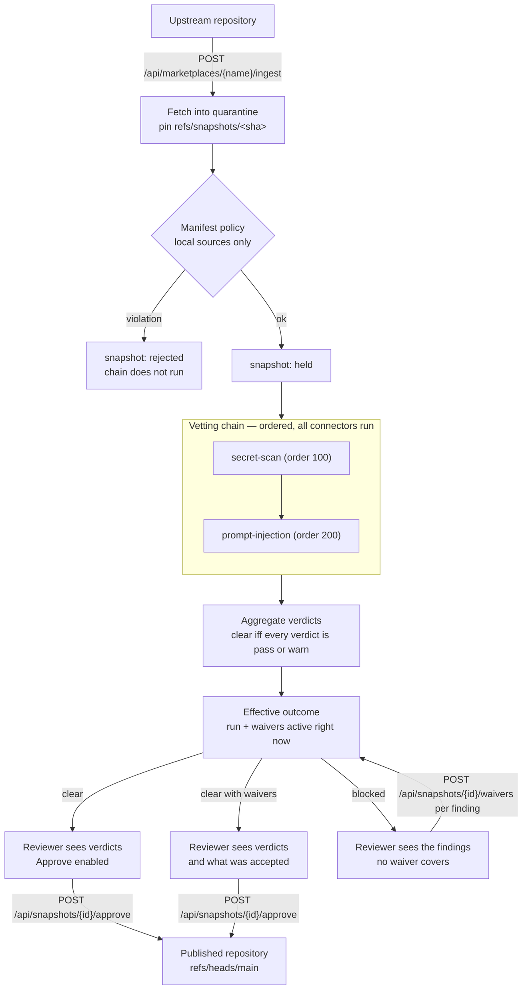

# Vetting — the connector chain

Every snapshot the gateway ingests is quarantined and pinned to an upstream
commit SHA. Between that pin and the reviewer's decision the gateway runs a
**vetting chain**: an ordered list of connectors, each of which looks at the
snapshot's content and answers with a verdict. The verdicts and their findings
are recorded against the snapshot and shown to the reviewer before any approve
or reject decision.

The gateway does not vet content itself. It orchestrates: it runs connectors,
normalises what they answer, records it, and aggregates it into a single
outcome that gates approval.

## Where the chain sits

The chain never changes the snapshot's own state. A vetted snapshot is still
`held`; what the chain decides is whether approving it is an ordinary act or one
that has to be justified in writing.

That separation is what lets the same chain run again, later, over a snapshot
that is already approved and served — a new run against unchanged state. What
such a run *means* is a separate judgement, described in
[Re-vetting approved content](../guides/re-vetting.md): only a connector that
objects to the content can retract it, and a connector that merely broke never
can.

## The connector contract

A connector has a stable name, a position in the chain, and one method that
takes the snapshot and returns a verdict. What it is given is deliberately
narrow: the snapshot's id, its marketplace, its commit SHA, and a walk over the
files in that commit. It is not given a repository handle, so a connector cannot
move a ref, write to quarantine, or read another marketplace's content.

A verdict carries a state, an optional external report URL, and a list of
findings. A finding has a **stable rule id** (`aws-access-key-id`), a severity,
a location (normally `path:line`), and a reviewer-facing message. The rule id is
the identity a [scoped waiver](#waivers-accepted-risks-with-a-scope-and-an-expiry)
is written against, so it is part of the contract rather than a display string.

### Verdict states

| State | Meaning | Blocks approval |
| --- | --- | --- |
| `PASS` | The connector found nothing. | No |
| `WARN` | Something worth showing the reviewer that does not block. | No |
| `FAIL` | Something that blocks. | Yes |
| `ERROR` | The connector produced no verdict: it threw, or it exceeded its time limit. | Yes |
| `PENDING` | The connector was triggered and has not answered yet. | Yes |

A connector does not choose its state directly: it emits findings, and the
verdict follows the worst severity present — `HIGH` or `CRITICAL` fails,
`LOW` or `MEDIUM` warns, and `INFO` alone still passes. That way a new rule only
has to get its severity right.

`PENDING` exists so that an asynchronous connector — one that is triggered over
a webhook and answers later — fits without changing the gate. No built-in
connector returns it today.

## Fail-closed aggregation

A chain run is **clear** if and only if it produced at least one verdict and
every verdict is `PASS` or `WARN`. Everything else is **blocked**:

- any connector that failed;
- any connector that crashed or timed out — a crash is a blocked snapshot, never
  a skipped connector;
- any connector that has not answered;
- **and a snapshot with no chain run at all.**

That last case is the one that matters most. A snapshot ingested before the
chain existed, or one whose run died halfway, is blocked — absence of evidence
is not evidence of safety.

All connectors run, in order; the chain does not stop at the first failure,
because a reviewer should see everything that is wrong with a snapshot at once.

## The approval gate

`POST /api/snapshots/{id}/approve` takes no request body. It refuses a snapshot
whose **effective** outcome is blocked, with `409` and a problem document naming
both the blocking connectors and — in `uncoveredFindings` — every blocking
finding that no active waiver covers. That array is the reviewer's worklist: it
is exactly the set of waivers that must exist for the approval to succeed.

There is no blanket override. The only way past objecting connectors is to
accept each blocking finding individually with a
[waiver](#waivers-accepted-risks-with-a-scope-and-an-expiry).

### Not a connector: the minimum release age

The same gate carries one precondition the chain has nothing to do with. When
[`minimum-release-age`](../reference/configuration.md#minimum-release-age) is
configured, a snapshot the gateway ingested less than that long ago cannot be
approved however clear its verdicts are — a cooling-off window that gives the
world time to notice a compromised release before this gateway adopts it.

It is deliberately not a connector. A verdict is evidence about content at the
moment it was gathered; "too young" is a fact about now. Recorded as a failing
verdict it would keep blocking after the age had passed, until some later
re-vetting run happened to replace it. Checked at the approval request instead,
it clears itself and leaves nothing behind — the same reasoning that makes
waiver expiry a comparison rather than a state.

## Waivers: accepted risks with a scope and an expiry

A **waiver** is an accepted-risk exception for **one finding rule**, on **one
marketplace**, within **one scope**, until **one date**. All four are mandatory,
and so are a justification and the identity accepting the risk. There is no way
to express an unlimited waiver — `expires_at` is `NOT NULL` in the schema, and a
past expiry is refused at creation.

| Scope | The scope value is | It covers a finding when |
| --- | --- | --- |
| `SNAPSHOT` | the snapshot's commit SHA | the finding is on that exact commit |
| `PATH` | a repository-relative path | the finding's path is that path, or lies under it |

Scope is matched against the **path part** of a finding's location, never the
line number: inserting a line above a finding moves the number, and a waiver
that evaporates on an unrelated edit trains reviewers to re-waive without
reading. Path matching is a prefix on a segment boundary — `plugins/a` covers
`plugins/a/x.md` but never `plugins/ab.md` — and there is no glob syntax.

`SNAPSHOT` scope is the tighter of the two and is what the portal offers first:
it dies with the SHA, so the next ingestion blocks again and the acceptance has
to be made deliberately a second time. A `PATH` waiver survives re-ingestion,
which is its purpose and also its cost — it covers content that does not exist
under that path yet. That is why an expiry is mandatory rather than advisory.

### The effective outcome

The recorded chain run is never rewritten. It stays raw evidence of what the
connectors said. What gates an approval is the **effective outcome**, computed
on every read from that run plus the waivers active *at that instant*:

- a `PASS` or `WARN` verdict stays clearing — a waiver can only ever remove an
  objection, never create one;
- a blocking verdict **with no findings** stays blocking. `PENDING` can never be
  waived away, because there is nothing to name;
- a blocking verdict **with** findings is re-derived from the findings that are
  left, by the same severity rule the connector's own state came from. Waive
  every `HIGH`/`CRITICAL` finding and the verdict clears.

| Effective states | A waiver suppressed something | Outcome |
| --- | --- | --- |
| all clearing, run non-empty | no | `CLEAR` |
| all clearing, run non-empty | yes | `CLEAR_WITH_WAIVERS` |
| anything else, or no run at all | — | `BLOCKED` |

`CLEAR_WITH_WAIVERS` is a different word from `CLEAR` on purpose. A reviewer or
an auditor glancing at a badge must never read an accepted risk as a clean
chain.

### Expiry needs no scheduler

A waiver is active only while `expires_at` is in the future and it has not been
revoked, and that is decided at the moment the effective outcome is computed —
on the approve request, on the vetting API read, on the portal poll. So an
expired waiver stops suppressing on the very next evaluation, and the snapshot's
effective outcome reverts to `BLOCKED` with nothing having had to run in the
background. Revoking a waiver has the same effect immediately.

An hourly sweep writes a `waiver-expired` entry the first time it notices a
lapsed waiver. It has no authority over the gate — the gate is already correct
without it — so it only decides whether the lapse is *announced* in the ledger
rather than merely observable in it.

!!! warning "Expiry re-closes the gate immediately; retraction waits for a re-vet"

    A snapshot approved while a waiver was active stays published the moment that
    waiver lapses. What returns instantly is the *gate*: the snapshot reads as
    blocked again, and any future approval needs a fresh acceptance.

    Taking the content back is
    [continuous re-vetting](../guides/re-vetting.md)'s job. The next re-vetting
    run over that snapshot finds the finding uncovered again and reports a
    violation — recorded and announced in the default `warn` mode, and revoking
    the snapshot under `enforce`. So under enforcement a waiver's expiry is a
    real deadline, not a reminder.

!!! warning "`connector-error` is waivable"

    A connector that crashed or timed out records a `connector-error` finding,
    and the uniform rule above makes it waivable like any other. That is a real
    operational need — an external scanner down for a day — but it means
    accepting "the scanner never looked at this". It is the single most
    consequential thing a reviewer can write here, and the ledger names the rule
    so it can be found.

## The built-in connectors

Both connectors ship in the gateway and run in every chain.

### `secret-scan`

Regex and entropy rules over every UTF-8 text file in the snapshot: AWS access
key ids and secret keys, PEM private-key blocks, GitHub, Slack and Google
tokens, JSON Web Tokens, and assignment-shaped values whose Shannon entropy is
high enough to be a real credential rather than an identifier.

Findings never echo the matched value — a finding that quoted the secret would
put it in the ledger and the portal.

### `prompt-injection`

Pattern heuristics over the snapshot's Markdown instruction content
(`SKILL.md`, commands, agents):

| Rule | What it looks for |
| --- | --- |
| `instruction-override` | "ignore all previous instructions" and its close relatives |
| `system-prompt-disclosure` | Asking the agent to reveal its prompt or instructions |
| `credential-path-reference` | `~/.aws/credentials`, `~/.ssh`, `.npmrc`, `/etc/passwd`, … |
| `concealment-instruction` | Telling the agent not to tell the user or the reviewer |
| `pipe-to-shell` | `curl … \| sh` inside instructions |
| `exfiltration-instruction` | Sending credentials or environment values to a host |
| `hidden-html-instruction` | Agent-directed text inside an HTML comment |
| `invisible-characters` | Zero-width, bidirectional, and Unicode-tag characters used to hide text from a human reading the diff |

!!! warning "What a passing verdict does *not* mean"

    These are patterns, not understanding. An attacker who paraphrases
    ("disregard the guidance you were given earlier"), splits an instruction
    across files, or encodes it walks past every rule above. The same is true of
    `secret-scan`: it matches shapes, so an unshaped or wrapped credential is
    invisible to it.

    A `PASS` means "no known marker matched". It is triage that tells a reviewer
    where to look first — it is not a statement that the snapshot is safe, and
    reading the content is still the reviewer's job. Semantic review of skill
    instructions needs an LLM review connector, which is not part of this chain
    yet.

## Coverage gaps are reported, not hidden

A file larger than the configured size limit, or one that is not valid UTF-8, is
not silently skipped: the connector records an informational
`file-not-scanned` finding naming the path. Informational findings do not change
the verdict, but they are visible, so "the scanner did not look at this" is
never invisible.

## What lands in the ledger

Every chain run writes to the append-only ledger: one entry per connector
verdict (`vetting-verdict`, with `connector=state` in its detail) and one entry
for the run outcome (`vetting-completed`).

The whole waiver lifecycle lands there too:

| Event | Written when | Detail carries |
| --- | --- | --- |
| `waiver-created` | a risk is accepted | rule, scope, expiry |
| `waiver-applied` | a waiver lets an approval through | waiver id, rule, location, approver, expiry |
| `waiver-revoked` | a waiver is withdrawn | rule, scope |
| `waiver-expired` | the sweep first notices a lapse | rule, scope, approver, expiry |

An auditor asking "why is a snapshot with a critical finding being served" can
answer it from the ledger alone — including what was accepted, by whom, and
until when.

## Reading further

- [Approving and rejecting snapshots](../guides/approving-snapshots.md) — the
  reviewer's task, end to end.
- [Waiving a vetting finding](../guides/waiving-findings.md) — accepting a risk,
  end to end.
- [Admin portal](../reference/portal.md#vetting) — where the verdicts appear.
- [Configuration](../reference/configuration.md#vetting) — the knobs.
- [Trust boundaries](trust-boundaries.md) — why approval is the boundary the
  chain protects.
