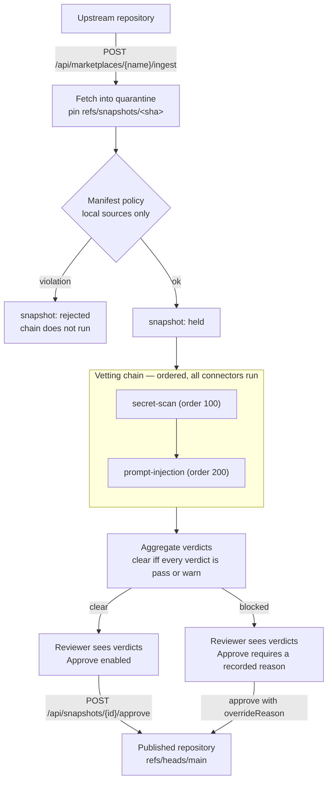

# Vetting — the connector chain

Every snapshot the gateway ingests is quarantined and pinned to an upstream
commit SHA. Between that pin and the reviewer's decision the gateway runs a
**vetting chain**: an ordered list of connectors, each of which looks at the
snapshot's content and answers with a verdict. The verdicts and their findings
are recorded against the snapshot and shown to the reviewer before any approve
or reject decision.

The gateway does not vet content itself. It orchestrates: it runs connectors,
normalises what they answer, records it, and aggregates it into a single
outcome that gates approval.

## Where the chain sits

The chain never changes the snapshot's own state. A vetted snapshot is still
`held`; what the chain decides is whether approving it is an ordinary act or one
that has to be justified in writing.

## The connector contract

A connector has a stable name, a position in the chain, and one method that
takes the snapshot and returns a verdict. What it is given is deliberately
narrow: the snapshot's id, its marketplace, its commit SHA, and a walk over the
files in that commit. It is not given a repository handle, so a connector cannot
move a ref, write to quarantine, or read another marketplace's content.

A verdict carries a state, an optional external report URL, and a list of
findings. A finding has a **stable rule id** (`aws-access-key-id`), a severity,
a location (normally `path:line`), and a reviewer-facing message. The rule id is
the identity a future scoped waiver will be written against, so it is part of
the contract rather than a display string.

### Verdict states

| State | Meaning | Blocks approval |
| --- | --- | --- |
| `PASS` | The connector found nothing. | No |
| `WARN` | Something worth showing the reviewer that does not block. | No |
| `FAIL` | Something that blocks. | Yes |
| `ERROR` | The connector produced no verdict: it threw, or it exceeded its time limit. | Yes |
| `PENDING` | The connector was triggered and has not answered yet. | Yes |

A connector does not choose its state directly: it emits findings, and the
verdict follows the worst severity present — `HIGH` or `CRITICAL` fails,
`LOW` or `MEDIUM` warns, and `INFO` alone still passes. That way a new rule only
has to get its severity right.

`PENDING` exists so that an asynchronous connector — one that is triggered over
a webhook and answers later — fits without changing the gate. No built-in
connector returns it today.

## Fail-closed aggregation

A chain run is **clear** if and only if it produced at least one verdict and
every verdict is `PASS` or `WARN`. Everything else is **blocked**:

- any connector that failed;
- any connector that crashed or timed out — a crash is a blocked snapshot, never
  a skipped connector;
- any connector that has not answered;
- **and a snapshot with no chain run at all.**

That last case is the one that matters most. A snapshot ingested before the
chain existed, or one whose run died halfway, is blocked — absence of evidence
is not evidence of safety.

All connectors run, in order; the chain does not stop at the first failure,
because a reviewer should see everything that is wrong with a snapshot at once.

## The approval gate

`POST /api/snapshots/{id}/approve` refuses a snapshot whose latest run is
blocked, with `409` and a problem document naming the blocking connectors.

To approve it anyway, the request carries an `overrideReason`. The reason is
mandatory, and it is recorded twice: against the chain run (with the approving
identity and the time) and in the append-only audit ledger.

!!! warning "The override is blunt, on purpose"

    One reason covers the whole snapshot, has no expiry, and is not scoped to a
    finding. It is the smallest escape hatch that is still auditable. Scoped,
    expiring, per-finding waivers are a separate capability; when they arrive
    they become the ordinary way a blocked snapshot is cleared, and the blanket
    override becomes the last resort.

## The built-in connectors

Both connectors ship in the gateway and run in every chain.

### `secret-scan`

Regex and entropy rules over every UTF-8 text file in the snapshot: AWS access
key ids and secret keys, PEM private-key blocks, GitHub, Slack and Google
tokens, JSON Web Tokens, and assignment-shaped values whose Shannon entropy is
high enough to be a real credential rather than an identifier.

Findings never echo the matched value — a finding that quoted the secret would
put it in the ledger and the portal.

### `prompt-injection`

Pattern heuristics over the snapshot's Markdown instruction content
(`SKILL.md`, commands, agents):

| Rule | What it looks for |
| --- | --- |
| `instruction-override` | "ignore all previous instructions" and its close relatives |
| `system-prompt-disclosure` | Asking the agent to reveal its prompt or instructions |
| `credential-path-reference` | `~/.aws/credentials`, `~/.ssh`, `.npmrc`, `/etc/passwd`, … |
| `concealment-instruction` | Telling the agent not to tell the user or the reviewer |
| `pipe-to-shell` | `curl … \| sh` inside instructions |
| `exfiltration-instruction` | Sending credentials or environment values to a host |
| `hidden-html-instruction` | Agent-directed text inside an HTML comment |
| `invisible-characters` | Zero-width, bidirectional, and Unicode-tag characters used to hide text from a human reading the diff |

!!! warning "What a passing verdict does *not* mean"

    These are patterns, not understanding. An attacker who paraphrases
    ("disregard the guidance you were given earlier"), splits an instruction
    across files, or encodes it walks past every rule above. The same is true of
    `secret-scan`: it matches shapes, so an unshaped or wrapped credential is
    invisible to it.

    A `PASS` means "no known marker matched". It is triage that tells a reviewer
    where to look first — it is not a statement that the snapshot is safe, and
    reading the content is still the reviewer's job. Semantic review of skill
    instructions needs an LLM review connector, which is not part of this chain
    yet.

## Coverage gaps are reported, not hidden

A file larger than the configured size limit, or one that is not valid UTF-8, is
not silently skipped: the connector records an informational
`file-not-scanned` finding naming the path. Informational findings do not change
the verdict, but they are visible, so "the scanner did not look at this" is
never invisible.

## What lands in the ledger

Every chain run writes to the append-only ledger: one entry per connector
verdict (`vetting-verdict`, with `connector=state` in its detail), one entry for
the run outcome (`vetting-completed`), and — when a reviewer overrides —
`snapshot-approved-override` carrying the reason and the approving identity.

An auditor asking "why is a snapshot with a critical finding being served" can
answer it from the ledger alone.

## Reading further

- [Approving and rejecting snapshots](../guides/approving-snapshots.md) — the
  reviewer's task, end to end.
- [Admin portal](../reference/portal.md#vetting) — where the verdicts appear.
- [Configuration](../reference/configuration.md#vetting) — the two knobs.
- [Trust boundaries](trust-boundaries.md) — why approval is the boundary the
  chain protects.
