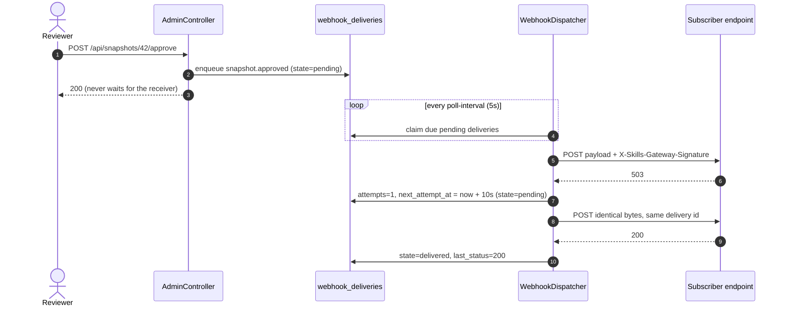

# Receiving lifecycle webhooks

The gateway records every vetting decision in the ledger. Webhooks push those
same decisions outward, so CI, chat and inventory systems learn about a snapshot
the moment it is ingested, approved or rejected instead of polling
`/api/marketplaces`.

## Events

| Event | Emitted when |
| --- | --- |
| `snapshot.ingested` | An ingestion succeeded and produced a snapshot. |
| `snapshot.approved` | A held snapshot was approved and published. |
| `snapshot.rejected` | A held snapshot was rejected. |
| `snapshot.soft_deleted` | A snapshot was marked deleted, by an administrator or by a retention policy. |
| `snapshot.restored` | A soft-deleted snapshot's marks were cleared. |
| `snapshot.vetted` | A vetting chain run finished. The verdicts are readable at `GET /api/snapshots/{id}/vetting`. |
| `snapshot.revet_violation` | A re-vetting run found a violation on a snapshot that is **already approved**. |
| `snapshot.revoked` | A snapshot was retroactively quarantined; the facade no longer serves it. |

Those are all of them. Deletion is orthogonal to the snapshot state machine,
which is why the retention events carry the snapshot's unchanged vetting state.

An action taken by a scheduled pass rather than by a person carries a policy
actor — `retention-policy` for deletions, `revet-policy` for re-vetting — so a
receiver can tell the two apart. See
[Reclaiming snapshot storage](snapshot-retention.md) and
[Re-vetting approved content](re-vetting.md).

!!! warning "`snapshot.revet_violation` is the one that needs a receiver"

    It says content a team is *already using* has stopped being acceptable, and
    in the default warn mode it is the only signal — nothing is unpublished, so
    nothing breaks to announce it. Read the payload's `state` to tell the two
    apart: `approved` means it is still being served and someone has to act;
    `revoked` means enforcement already retracted it and
    `snapshot.revoked` follows.

With [role enforcement](delegated-administration.md) enabled, registering and
deleting subscribers require **admin**; the subscriber and delivery listings
require **auditor** (or admin).

## 1. Register a subscriber

=== "Portal"

    **Webhooks** → fill in **Subscriber name** and **Target URL**, tick the **Events**
    to receive (all of them by default; the box above the list narrows it) →
    **Add subscriber**. The signing secret appears in a dialog with a copy
    button.

=== "API"

    ```console
    $ curl -X POST localhost:8080/api/webhooks \
        -H 'Content-Type: application/json' \
        -d '{"name":"ci-bot","url":"https://ci.example.com/hooks/skills-gateway",
             "events":"snapshot.approved,snapshot.rejected"}'
    ```

    ```json
    {"id":1,"name":"ci-bot","url":"https://ci.example.com/hooks/skills-gateway",
     "events":"snapshot.approved,snapshot.rejected",
     "secret":"whsec_...","createdAt":"..."}
    ```

| Field | Rule |
| --- | --- |
| `name` | `^[a-z0-9][a-z0-9_-]*$`, unique. A bad name is **422**, a duplicate is **409**. |
| `url` | The scheme must be on `skills-gateway.allowed-url-schemes`. Unparseable or scheme-less URLs are rejected — the check fails closed. **400**. |
| `events` | Comma-delimited event names, or `*` for every event. Blank means `*`. An unknown name is **400**, not silently dropped. `GET /api/webhooks/events` answers the names this gateway accepts. |

The filter is exact-match per name: `*` is the only wildcard, and
`snapshot.*` is not a valid filter. A subscriber only ever receives events its
filter lists.

Registering an outbound target is an egress decision, which is why it is an
authenticated administrative act behind the same scheme allowlist as marketplace
registration.

!!! danger "The signing secret is shown exactly once"

    `whsec_…` is returned only in the creation response and by no other endpoint.
    Unlike a personal access token it is stored recoverably — signing needs the
    key — but nothing ever reads it back over the API. A lost secret means
    deleting the subscriber and registering it again.

## 2. Handle the delivery

Each delivery is a `POST` of a JSON body with four headers:

| Header | Contents |
| --- | --- |
| `X-Skills-Gateway-Event` | The event name. |
| `X-Skills-Gateway-Delivery` | The delivery id — your de-duplication key. |
| `X-Skills-Gateway-Timestamp` | ISO-8601 time of *this attempt*, so it differs between retries. |
| `X-Skills-Gateway-Signature` | `sha256=<lowercase hex>` — HMAC-SHA256 over the exact body bytes, keyed with the subscriber's secret. |

```json
{"event":"snapshot.approved","occurredAt":"2026-08-15T09:14:22.481Z",
 "marketplace":"acme","snapshotId":42,
 "sha":"3f9c2ab9d1e4c7b6a5f80c3d2e1b0a9f8c7d6e5f",
 "state":"approved","actor":"alice@example.com"}
```

`state` is the snapshot state *after* the event, and `actor` is the principal
that performed the admin action.

## 3. Verify the signature

Compute the HMAC over the raw request body — the bytes as received, before any
JSON parsing or re-serialization. The payload is serialized once when the event
is emitted and stored, so every retry sends byte-identical content.

=== "Python"

    ```python
    import hashlib, hmac

    def verify(secret: str, body: bytes, header: str) -> bool:
        expected = "sha256=" + hmac.new(
            secret.encode(), body, hashlib.sha256
        ).hexdigest()
        return hmac.compare_digest(expected, header)
    ```

=== "Node"

    ```js
    import { createHmac, timingSafeEqual } from "node:crypto";

    function verify(secret, body, header) {
      const expected =
        "sha256=" + createHmac("sha256", secret).update(body).digest("hex");
      const a = Buffer.from(expected);
      const b = Buffer.from(header);
      return a.length === b.length && timingSafeEqual(a, b);
    }
    ```

!!! warning "Compare in constant time, and reject before parsing"

    Use `hmac.compare_digest` / `timingSafeEqual` rather than `==`, and verify
    before the body reaches any application logic. An unsigned or wrongly signed
    request is an unauthenticated request.

## Delivery, retry and backoff

Emission is enqueue-only. The admin action writes one delivery row per matching
subscriber and returns; an unreachable receiver can never fail or slow down an
approval. A background dispatcher polls for due deliveries, claims each one with
an atomic conditional update, and POSTs it.



A 2xx marks the delivery `delivered`. Everything else — a non-2xx status or a
transport error — is retried, because a 4xx from a receiver is usually a
misconfiguration an operator will fix and the attempt budget bounds the cost.
Attempt *n* schedules the next attempt at `base × 2^(n-1)`, capped:

| Attempt | Delay before it, with the defaults |
| --- | --- |
| 1 | immediate (within one poll interval) |
| 2 | 10s |
| 3 | 20s |
| 4 | 40s |
| 5 | 80s |

After the fifth attempt the delivery is `failed` and never retried. A delivery
whose subscriber has been deleted fails immediately with
`subscriber no longer exists`.

Tune all of this under
[`skills-gateway.webhooks.*`](../reference/configuration.md#webhooks).

!!! warning "Delivery is at-least-once"

    A receiver that returns 2xx after a network timeout will be retried, and a
    process restart mid-attempt makes the delivery due again once its lease
    expires. **De-duplicate on `X-Skills-Gateway-Delivery`** — it is stable
    across every retry of the same delivery — and treat handlers as idempotent.

## Watch what happened

=== "Portal"

    The **Webhooks** page lists recent delivery attempts with their event,
    subscriber, state, attempt count and last response — see
    [Admin portal](../reference/portal.md#webhooks).

=== "API"

    ```console
    $ curl 'localhost:8080/api/webhooks/deliveries?limit=20'
    ```

    Most recent first. `limit` defaults to 100 and is clamped to 500.

Each row carries `state`, `attempts`, `lastStatus` and `lastError`, which is
enough to tell a receiver that is down from one that is rejecting the payload.

## Remove a subscriber

```console
$ curl -X DELETE localhost:8080/api/webhooks/1
```

**204** on success, **404** if it never existed. The subscriber and its delivery
history go with it, and no further events are queued for it. Subscriber creation
and deletion are themselves recorded in the ledger as
`webhook-subscriber-created` and `webhook-subscriber-deleted`.
