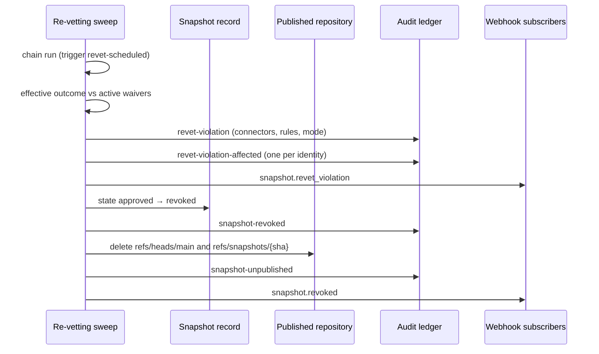

# Re-vetting approved content

An approval is a judgement made against the evidence of one day. Connectors gain
rules, advisories land, and accepted risks expire — so an estate whose approvals
are never re-examined slowly turns into a set of assertions nobody has checked.

Continuous re-vetting runs the [vetting chain](../concepts/vetting.md) again over
snapshots that are **already approved and being served**, and decides what a
fresh answer means for content teams already depend on.

## What the sweep does

On its schedule, the gateway takes the approved snapshots whose newest chain run
is **oldest**, up to a batch size, and re-runs the chain over each. Each pass
records a new run — trigger `revet-scheduled`, with the identity and version of
every connector that produced it — and never edits the previous one.

Oldest-first in bounded batches is what makes this affordable. A sweep that
re-vetted everything on every tick would be a periodic load spike proportional to
the estate; one that picked arbitrarily would starve whichever snapshots it never
reached. Every approved snapshot is reached in rotation, and the longest any one
waits is bounded by the batch size and the interval.

Nothing else is eligible. A `held` snapshot is vetted by the review surface, and
a `rejected` or `revoked` one is not serving anything that could be retracted.

## What a fresh answer means

The chain run is evidence; what it *means* for served content is a separate
judgement, and the gateway draws three lines.

| Classification | When | What happens |
| --- | --- | --- |
| **Clear** | Nothing objects, or only an active waiver stands between the run and clear. | Nothing. The run is recorded. |
| **Violation** | A connector objects to the **content**, and no active waiver covers the finding. | Recorded, announced, and — in `enforce` mode — the snapshot is revoked. |
| **Inconclusive** | The run blocks only because a connector errored, timed out, has not answered, or produced no verdict at all. | Recorded and announced. The snapshot stays approved and served, in **either** mode. |

The effective outcome is what decides — the run with the waivers active at that
instant layered over it. A finding somebody accepted, in writing, with an expiry,
must not quarantine content; otherwise a waiver would clear the approval gate
only to be ignored by the next sweep.

!!! note "Why a broken connector never retracts anything"

    Approval asks *may this be published?* and fails closed on everything,
    because nothing is being served yet and the cost of an over-strict answer is
    one delayed review.

    Re-vetting asks *must this be retracted?*, and the cost of an over-strict
    answer is pulling live content out from under every consumer. A connector
    that threw is evidence about the **scanner**, not about the content — and a
    shared connector outage would otherwise revoke an entire estate at once,
    turning a scanner bug into an outage of exactly the content the gateway
    exists to serve.

    Nothing is weakened: fail-closed still governs every path that *publishes*.
    An inconclusive run leaves the recorded run blocked, so the snapshot cannot
    be approved or re-approved while the chain is broken. The only thing
    declined is retracting content on evidence that says nothing about it.

## Warn first, then enforce

`skills-gateway.vetting.revet.mode` decides what a violation does, and it is
`warn` by default.

=== "warn (default)"

    The violation is written to the ledger with the objecting connectors, the
    rules behind it, and one entry per identity that had already fetched the
    snapshot. `snapshot.revet_violation` goes out to subscribers. The portal
    shows it.

    **Publication is untouched.** The snapshot stays `approved` and every
    consumer keeps fetching it.

=== "enforce"

    Everything warn mode does, and then the snapshot is revoked: its state moves
    to `revoked`, the published refs it was reachable through are removed, and
    `snapshot.revoked` is emitted.

Run `warn` for at least one full sweep cycle before enabling `enforce`, and read
the `revet-violation` ledger entries. Each one names the identities that had
already fetched the snapshot — that is precisely the blast radius `enforce`
would have caused, measured before granting it the power to cause it.

```yaml
skills-gateway:
  vetting:
    revet:
      enabled: true
      mode: warn      # warn | enforce
      interval: 6h
      cadence: 24h
      batch-size: 25
```

Every knob is in the
[configuration reference](../reference/configuration.md#continuous-re-vetting).

## Re-vetting on demand

The sweep covers the estate in rotation; the endpoints cover "I need the answer
now".

=== "Portal"

    On the marketplace page, an approved snapshot carries **Re-vet now**. The
    toast says what the run concluded.

=== "API"

    ```bash
    # one snapshot
    curl -X POST https://gateway.example.com/api/snapshots/12/revet

    # every approved snapshot of a marketplace
    curl -X POST https://gateway.example.com/api/marketplaces/corp-marketplace/revet
    ```

Both record their runs with trigger `revet-manual`.

!!! info "Scanner and advisory feeds"

    The built-in `secret-scan` and `prompt-injection` connectors have no
    external feed to subscribe to: their rules ship with the gateway. So
    "re-vet when the feed updates" is, today, an operator calling
    `POST /api/marketplaces/{name}/revet` after deploying a connector whose
    rules changed — and the run records the connector versions, so an answer
    that changed can be attributed to the chain rather than guessed at.

    A webhook-triggered feed integration is a follow-on, not something this
    version does quietly.

## What a revocation looks like

A revoked snapshot has stopped being served, and the gateway makes that visible
rather than silent.



The order is the safety property: the evidence and the announcement are written
**before** anything is unpublished, so a crash mid-way leaves recorded content
that is still served, never retracted content nobody can explain.

Two refs are removed, not one. `refs/heads/main` is the served tip — and only
when it is still this snapshot, so revoking one a later approval already
superseded does not take the marketplace down. `refs/snapshots/{sha}` is
advertised in its own right, so leaving it behind would keep the revoked commit
fetchable by anyone who knows its SHA, which is everyone who ever cloned it.

**Quarantine is untouched.** Nothing is re-ingested and nothing is deleted; the
content is still pinned where it always was, which is what makes the decision
reviewable and reversible by a person.

### Who already has it

`GET /api/snapshots/{id}/fetchers` — and the portal panel on a revoked snapshot —
lists every authenticated identity that received the content through the facade,
with a fetch count and a last-fetch time, read from the append-only ledger the
gateway has been keeping since the first clone.

It names principals, not teams: the gateway knows who authenticated, and mapping
a principal to a team is the identity provider's knowledge. Direct per-team
notification is a follow-on; what exists today is the list an operator acts on.

## Getting a revoked snapshot back

There is no un-revoke. The route back is the ordinary
[approve](approving-snapshots.md#re-approving-a-revoked-snapshot) endpoint,
behind the same gate:

1. Read the violation — the blocking findings are on the snapshot's vetting
   panel.
2. Either [waive](waiving-findings.md) each blocking finding, with a
   justification and an expiry, or re-ingest a corrected upstream commit and
   approve *that* snapshot instead.
3. Approve. The transition records a new reviewer and timestamp and clears the
   revocation marks; what it was revoked for stays in the ledger.

Rejecting it instead is the terminal answer.

!!! warning "An expired waiver becomes a violation on the next re-vet"

    A waiver lapsing re-closes the *gate* immediately — that needs no scheduler.
    What it does **not** do on its own is retract content approved while it was
    active. Re-vetting is what closes that gap: the next run over that snapshot
    finds the finding uncovered again, and reports a violation.

    So a waiver's expiry is a real deadline under `enforce`, not a reminder.
    Size expiries so the risk is genuinely resolved before them.

## What lands in the ledger

| Event | Meaning |
| --- | --- |
| `vetting-completed` | Every run, with its trigger, outcome and chain identity. |
| `revet-clear` | A re-vetting run that found nothing. |
| `revet-inconclusive` | The chain could not conclude; the snapshot stays approved. |
| `revet-violation` | A retroactive violation, with the objecting connectors, the rules and the mode in force. |
| `revet-violation-affected` | One entry per identity that had already fetched the snapshot. |
| `snapshot-revoked` | The state transition out of `approved`. |
| `snapshot-unpublished` | The refs that were removed, and whether the marketplace still serves anything. |

## Interaction with retention

`revoked` is not `approved`, so retention's approved-only guard no longer
protects a revoked snapshot — and that was decided rather than inherited.
Retention treats a revoked snapshot exactly as it treats a rejected one:
deletable by an administrator and by the `superseded` criterion, never by
`held-max-age`, and always subject to the `min-idle` veto — which is what keeps
it around while the consumers that fetched it before the revocation are recent.

See [Snapshot retention](../reference/retention.md).
