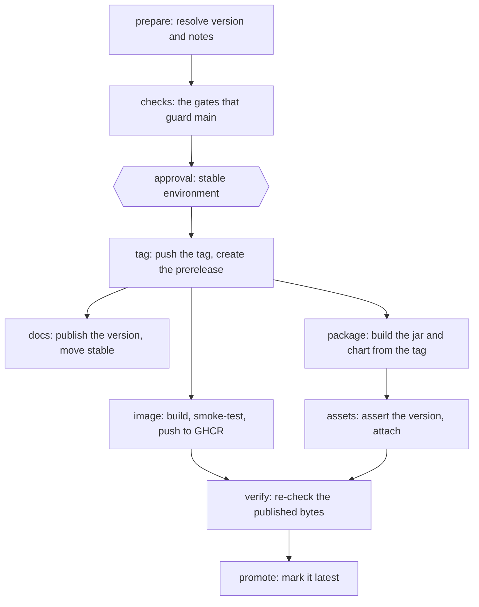

# Cutting a release

A release is a manual, gated act. The **Release** workflow owns the whole
sequence — resolve the version, run the gates, tag, publish, verify, promote —
and nothing about it happens as a side effect of a push.

## Before the first release

Two repository settings must be in place. Neither lives in the repository, and
one of them fails silently if it is missing.

!!! danger "The `stable` environment must exist with a required reviewer"

    The approval step is bound to a GitHub environment named `stable`. GitHub
    creates a missing environment on demand **with no protection rules**, so if
    it has not been configured by hand the approval job runs straight through
    and the gate does nothing at all — no error, no warning.

    Create it under **Settings → Environments**, add a required reviewer, and
    confirm the workflow pauses on a real run. Environment protection rules are
    free on public repositories.

!!! warning "Pages must be served from GitHub Actions"

    Documentation deployment runs in the **Docs** workflow, which needs
    **Settings → Pages → Source** set to *GitHub Actions*. While it is still on
    the legacy `gh-pages` branch source, the deploy job fails.

    `mike` still owns versioning on the `gh-pages` branch; only the serving
    mechanism changed. Doing this also retires the built-in
    `pages-build-deployment` run.

## Versions and tags

**The git tag is the only version.** Nothing in the repository holds a version
string that a human edits — Maven derives it from git state through
[Nisse](https://github.com/maveniverse/nisse), and the Helm chart's `version`
is a placeholder that the release stamps from the tag.

Tags are **bare three-part semantic versions**: `1.2.0`, never `v1.2.0`. The
changelog configuration, the published image tag and the version validator all
expect the bare form.

Releases may only be cut from `main`, `hotfix/*` or `release/*`, and only from
a commit that is reachable from that branch and does not already carry a
release tag.

### The version between tags

On any commit that is not itself tagged, Nisse derives a `-SNAPSHOT` version by
increasing the last release tag, and it reads the size of that increase from
the **Conventional Commits** in `tag..HEAD` — the same source the release
workflow derives from. `.mvn/maven.config` selects it:

```
-Dnisse.source.jgit.versionIncrement=conventionalCommits
-Dnisse.source.jgit.versionIncrement.zeroMajorDemotion=true
```

The highest increase in the range wins. Against a `0.1.0` tag:

| Highest commit in `tag..HEAD` | Version on `main` |
| --- | --- |
| `fix:`, `chore:`, or anything not a Conventional Commit | `0.1.1-N-SNAPSHOT` |
| `feat:` | `0.2.0-N-SNAPSHOT` |
| `feat!:`, or a `BREAKING CHANGE:` footer | `0.2.0-N-SNAPSHOT` |

`N` is the number of commits since the tag. A breaking change lands on the
minor rather than the major because `zeroMajorDemotion` holds the `0.x` line —
which is the same rule the release workflow applies, and the reason reaching
`1.0.0` needs `version` and `force` together.

The consequence worth stating plainly: **every commit message is a vote on the
next version.** A `feat:` in a pull request moves the whole line's minor, and a
`!` moves it as far as the pre-1.0 rule allows.

Until the first release tag exists there is nothing to increase, so the version
stays at the `0.1.0-N-SNAPSHOT` fallback whatever the commits say.

## Running it

**Actions → Release → Run workflow.** The branch you pick in the dropdown is
the branch that gets released; there is deliberately no ref input, so what the
gates verify is always what gets tagged.

| Input | Meaning |
| --- | --- |
| `version` | Leave empty to derive it from the Conventional Commits since the last tag. |
| `prerelease` | `none` for a release; `rc`, `b` or `a` for a candidate. The number is chosen for you (`1.2.0` → `1.2.0-rc1`, then the next). |
| `force` | Required before a hand-entered `version` that disagrees with the derived one is accepted. |
| `dry-run` | **On by default.** Resolves and reports; tags nothing, publishes nothing. |

### Preview first

A dry run is the `prepare` job and nothing else, so it costs one cheap job. It
writes the resolved version, the version it derived, the previous tag and the
rendered release notes to the run summary. Read that before turning `dry-run`
off.

If nothing in the range earns a version bump — only `ci:`/`build:` commits, or
nothing conventional — the run fails saying exactly that, rather than
reporting a tag collision.

### Overriding the version

Passing a `version` that differs from the derived one fails unless `force` is
also set. That pairing is the point: a hand-entered version is accepted only
when someone has deliberately said so. Reaching `1.0.0` from a `0.x` line needs
both, because a breaking change before 1.0 bumps the minor rather than
declaring the API stable by accident.

## What happens, in order



Two properties of that order are deliberate:

**The approval decides whether the version exists.** Nothing before it is
durable: `prepare` resolves and reports, `checks` runs the gates, and neither
writes anything to the repository or the world. The tag is the first
irreversible step — "the git tag is the only version" — so it is behind the
gate along with everything it feeds.

What you approve is the run itself, which is where the evidence is: `prepare`
has written the resolved version, the version it derived, the previous tag and
the rendered release notes into the run summary, and `checks` is green above
it. The `stable` environment's link points there rather than at a release page,
because at that moment there deliberately is no release to point at.

**A release is not "latest" until its bytes have been checked.** `verify`
downloads the published assets over the same unauthenticated path a consumer
takes and re-derives everything from what actually landed — a truncated or
clobbered upload is invisible to the build that produced it. Only then does
`promote` flip the release to latest.

A prerelease rather than a draft, because a draft's assets are not readable
without a token, so there would be nothing for `verify` to download.

## Release candidates

Choosing `rc`, `b` or `a` produces a candidate that is built, published and
verified like any release but **never promoted to latest**, and never moves the
documentation's `stable` alias. Candidates are also invisible to versioning:
the `1.2.0` that ends a candidate cycle is still computed from the last stable
tag, and its notes still span everything since that tag.

## If a release goes wrong

Where a run stops decides what it leaves behind.

**Stopped at `prepare`, at `checks`, or at the approval: nothing survives it.**
Neither job writes anything to the repository or to the world. Cancel it, or
reject the approval, and there is nothing to clean up.

**Stopped after `tag`: the version exists**, and every publishing job that
finished has added one more durable thing. Those three run in parallel, so a
stopped run can have left any subset of them.

| Job | What it leaves behind if it finished |
| --- | --- |
| `tag` | The tag `<version>`, and a GitHub prerelease that `/releases/latest` excludes |
| `package` and `assets` | The jar, the Helm chart and the SBOM, attached to that prerelease |
| `image` | `ghcr.io/skillsgateway/skillsgateway:<version>` in GHCR |
| `docs` | That documentation version published, and the `stable` alias moved to it |
| `promote` | The release marked latest — at which point the release is complete and there is nothing to recover |

A run that gets past `tag` without reaching `promote` ends with a **Partial
release** table in its run summary naming which of those steps succeeded, so the
state does not have to be reconstructed from the job list. `verify` cannot
report it: a failed publishing job skips `verify` along with everything after
it.

Two decisions follow, in this order.

### Can this version be re-run?

**No — not while its tag exists.** The tag job checks for the tag before it
creates anything and fails with `Tag '<version>' already exists`, so
re-dispatching the workflow for a version that is already tagged stops there.
Re-running is only possible after the tag is deleted.

!!! warning "Deleting a tag and re-running has not been exercised"

    The refusal above is what the workflow does; what a *successful* second run
    over a deleted tag and a deleted prerelease does has never been tried on
    this repository. Treat it as unverified. Fixing forward has been, and is the
    recommendation below.

### Fix forward, or clean up?

**Fix forward** unless the tag is genuinely private. Cut the next version once
the cause is fixed; the abandoned prerelease is excluded from
`/releases/latest`, so nothing that resolves "the latest release" ever sees it.
The cost is a version number and a prerelease that stays visible in the releases
list — which is also an honest record of what happened.

The `0.1.0` release of this repository is exactly this case: tagged and
pre-released with nothing behind it, deliberately left standing.

!!! note "A skipped version is visible in the version arithmetic"

    Nisse derives the version on `main` by incrementing the last tag, so an
    abandoned `0.1.0` still moves `main` to `0.2.0-N-SNAPSHOT`. The snapshot
    describes itself relative to a release that was never published. Harmless,
    and worth knowing before it reads as a bug.

**Clean up** only if you are certain nobody has fetched the tag — a tag someone
already has does not stop existing when the remote's copy is deleted, and their
copy may now point at a commit nobody else has. In practice that means within
minutes, on a repository nobody is watching. Undo in the reverse of the order
above:

```bash
# Documentation, if the docs job ran: remove the version and put `stable` back.
mike delete --push <version>
mike alias --push --update-aliases <previous-version> stable

# The container image, if the image job ran: delete that package version in
# Settings → Packages, or with the API.
gh api --method DELETE \
  /orgs/skillsgateway/packages/container/skillsgateway/versions/<id>

# The release and its assets, then the tag.
gh release delete <version> --repo skillsgateway/skillsgateway --yes
git push origin :refs/tags/<version>
```

With the tag gone the workflow will accept the version again — which, as above,
is the part nobody has yet done.

!!! note "Hand-pushing a tag publishes nothing"

    This is a change from earlier behaviour, and it is deliberate. `docs.yml`
    and `native.yml` used to watch for tags, so pushing one published the
    documentation and the container image immediately — unordered, and with no
    approval between the tag and the world. Both are now invoked *by* the
    release workflow instead. A tag pushed by hand is inert.

## What a release produces

| Artifact | Where |
| --- | --- |
| Release notes | The GitHub release, generated from Conventional Commits |
| `skills-gateway-<version>.tgz` | Attached to the release — the Helm chart, stamped with the version |
| `skills-gateway-<version>-cyclonedx.json` | Attached to the release — the CycloneDX SBOM |
| The jar | Attached to the release |
| `ghcr.io/skillsgateway/skillsgateway:<version>` | GHCR, with the SBOM attested against the pushed digest — see [Container image](../reference/container-image.md) |
| Versioned documentation | This site, with `stable` pointing at it |

## Related

- [Container image](../reference/container-image.md) — tags, and why to pin by digest
- [Compatibility](../reference/compatibility.md) — what a major version means for the API contract
