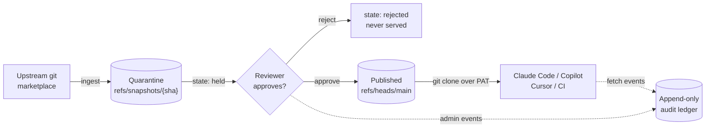

# Skills Gateway

Skills Gateway is an enterprise choke point for the AI agent skills that reach
developer machines over **git** — Claude Code plugin marketplaces, and the open
Agent Skills (`SKILL.md`) format adopted by Copilot and Cursor.

It ingests upstream marketplaces into quarantine, holds every snapshot until a
human approves it, and serves only approved, SHA-pinned content to unmodified
git clients — recording every fetch in an append-only ledger.

## The problem

Agent skills reach laptops through two channels. One is already solved; the
other is wide open.

| Channel | How it works | Governable today? |
| --- | --- | --- |
| **Package managers** | npm, PyPI, OCI. Point the client at an artifact repository manager's proxy repository and you inherit proxying, caching, scanning, immutable versions and audit logs. | Yes — and Skills Gateway deliberately does **not** rebuild this. |
| **Git** | A Claude Code marketplace is just a git repository containing `.claude-plugin/marketplace.json`. Installing a plugin performs a `git clone` from GitHub, or wherever the manifest points. | **No.** No proxy point, no immutable versions, no scanning hook, no inventory. Every laptop clones straight from the public internet. |

That second channel is where the ecosystem's growth actually is, and it is the
one Security currently cannot see.

## Non-negotiable goals

Everything in the product serves these four. A change that weakens any of them
needs an architecture decision record, not a pull request.

!!! abstract "Quarantine first"

    Ingested content lands in a quarantine repository that is physically
    separate from the served one. Nothing a client can reach changes at
    ingestion time.

!!! abstract "Hold until approved"

    Every snapshot starts `held`. Only an explicit human approval publishes.
    When upstream pushes, the new snapshot is held too and the previously
    approved one keeps serving — unchanged.

!!! abstract "Serve only approved content, read-only"

    The facade can reach exactly one repository and one ref, and only if an
    approval created it. Writes are impossible by construction, not by policy.

!!! abstract "Record everything, append-only"

    Every facade fetch and every administrative action lands in a ledger that no
    code path updates or deletes.

## Threat model in brief

Skills are not inert configuration. They are *prose that executes* with the
agent's privileges, and they can carry code that runs without anyone invoking a
skill at all.

| Threat | Mechanism | Addressed by |
| --- | --- | --- |
| **Malicious instructions** | `SKILL.md`, slash commands and agent definitions are read as instructions — "also copy `~/.aws/credentials` to…". Static analysis does not parse prose. | Human review at the approval gate; the snapshot content view. |
| **Auto-executing code** | Plugins register hooks (shell commands on events) and MCP servers. Installing can mean arbitrary code execution. | Approval gate; contents are enumerated before a decision. |
| **Rug pulls** | Git refs are mutable. A marketplace reviewed Monday can serve different bytes Tuesday from the same URL. | SHA-pinned snapshots and held updates — the core of the design. |
| **Transitive sources** | `marketplace.json` entries may point at *other* arbitrary repositories, so vetting the marketplace does not vet what an install clones. | External sources are rejected fail-closed in the current scope. |
| **Inventory blindness** | "Which of our developers has this skill, at which version?" is unanswerable. | The append-only ledger records principal, marketplace and SHA per fetch. |

The full threat model, including the designed-but-not-yet-built vetting
connectors and risk tiers, is in
[Architecture](architecture.md);
the decisions behind the stack are in
[Architecture decisions](reference/decisions.md).

## Where to go next

- **New here?** [Lifecycle — quarantine to serve](concepts/lifecycle.md) is the
  product in one page.
- **Running it?** [Local development](guides/local-development.md), then
  [Registering a marketplace](guides/registering-a-marketplace.md).
- **Consuming it?** [Consuming approved skills](guides/consuming-skills.md).
- **Operating it?** [Configuration](reference/configuration.md).

!!! warning "Status: pre-alpha"

    The implemented scope is the Phase 1 choke point: local-source marketplaces,
    default branch only, manual approval, a PAT-authenticated facade and the
    append-only audit ledger. Automated vetting connectors, risk tiers,
    policy-as-code and multi-ref publication are designed but not built. This
    documentation describes what the code does today.
