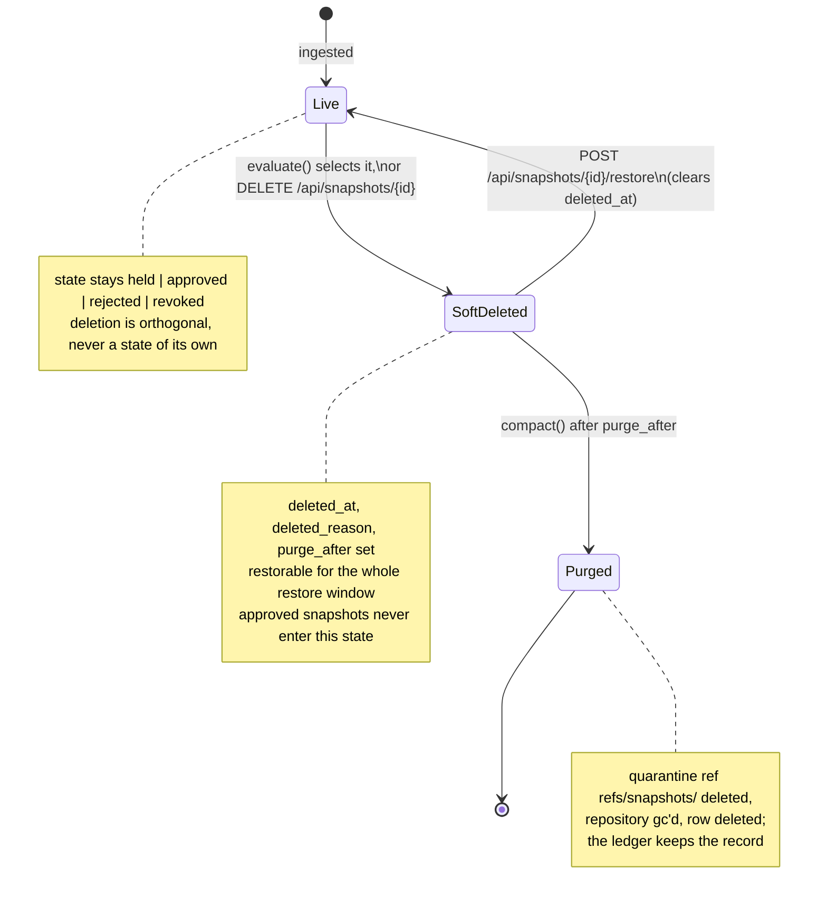

# Snapshot retention

What retention may select, what it may never touch, and what the two passes do.
Task-shaped coverage is in
[Reclaiming snapshot storage](../guides/snapshot-retention.md).

Retention is **off by default** (`skills-gateway.retention.enabled: false`). It
deletes only because an operator asked for it.

## Criteria

Evaluation resolves the [policy in force](#policies) for each marketplace, then
applies these:

| Criterion | Kind | Selects | Governed by |
| --- | --- | --- | --- |
| [Held too long](#held-too-long) | Selector | `held` snapshots ingested more than `held-max-age` ago. | `held-max-age` |
| [Superseded](#superseded) | Selector | `held`, `rejected` or `revoked` snapshots of a marketplace that a later `approved` snapshot has overtaken, once older than `superseded-min-age`. | `superseded`, `superseded-min-age` |
| [Minimum idle](#minimum-idle) | **Veto** | Nothing. It *removes* any candidate whose SHA was fetched through the facade within `min-idle`. | `min-idle` |
| [Approved](#approved-snapshots) | **Absolute guard** | Nothing. An `approved` snapshot is never eligible, by policy or by hand. | Not configurable |

A snapshot is deleted when a selector picks it and no veto or guard removes it.

### Held too long

`state = 'held'` and `created_at` older than `held-max-age` (default `90d`).
This is the unreviewed-quarantine backlog: snapshots ingested by polling that
nobody will ever open.

Setting `held-max-age` to zero or a negative duration **disables the criterion**
rather than making everything eligible — a fail-safe reading, since the
mis-typed value is the one that would otherwise delete the whole backlog.

### Superseded

`state IN ('held','rejected')`, older than `superseded-min-age` (default `30d`),
and some snapshot of the same marketplace with a higher id is `approved`.

Supersession deliberately does **not** extend to older *approved* snapshots,
even though they are no longer published — `main` was force-updated past them.
An older approved snapshot is exactly what a future team catalog would pin, and
the gateway cannot yet prove that nothing references it.

The criterion is a boolean as well as an age: `superseded: false` turns it off
without disturbing `superseded-min-age`.

### Minimum idle

A candidate whose SHA appears in the ledger as a facade fetch (`source <> 'admin'`)
within `min-idle` (default `30d`) is dropped from the pass.

!!! note "This veto cannot select anything today — and that is the point"

    Only *approved* snapshots are ever served, and approved snapshots are
    categorically ineligible, so "not fetched in N days" can never pick a
    candidate on its own in the current model. It is wired in as a veto so that
    the first feature which unpublishes a snapshot or pins historical approvals
    into a catalog inherits the protection instead of having to remember it.

### Approved snapshots

An `approved` snapshot is what the facade serves. It is never eligible:

- every eligibility query names the deletable states explicitly —
  `state IN ('held', 'rejected', 'revoked')` — so a policy pass cannot reach an
  approved one;
- the soft-delete `UPDATE` itself excludes approved snapshots, so served content
  stays served whatever a caller asks for;
- `DELETE /api/snapshots/{id}` refuses an approved snapshot with **409** before
  anything is written.

The guard is in SQL, not only in Java, which is why the check holds for the
policy pass and the manual endpoint alike. As a consequence retention never
touches the **published** repository — the only ref compaction removes lives in
quarantine.

### Revoked snapshots

A snapshot that [re-vetting revoked](../guides/re-vetting.md) is *not* approved,
so the guard above no longer covers it. That is deliberate, not a side effect:
the deletable states are named explicitly in the SQL precisely so that a new
state has to be added on purpose to become deletable.

Retention treats `revoked` exactly as it treats `rejected`:

- the **superseded** criterion may select it — it is not being served, and a
  later approved snapshot has taken its place;
- **`held-max-age` never does**, because that criterion names `held` itself;
- an administrator may delete it by hand, which the approved guard refused
  before the revocation;
- the **`min-idle` veto still applies**, which is what keeps a recently-revoked
  snapshot around while the consumers that fetched it before the revocation are
  still recent.

Deleting one destroys nothing anyone could fetch. What it was revoked for, and
who had already fetched it, stays in the append-only ledger regardless.

## The two passes

Deletion is reversible first and permanent later, and the two are separate
passes so that a wrong criterion costs a mark rather than content.

**Evaluate** (`skills-gateway.retention.poll-interval`, default hourly) marks:
it sets `deleted_at`, `deleted_reason` and `purge_after = now + restore-window`.
The vetting `state` is untouched — a deleted snapshot was still *held* or
*rejected*, and provenance and the ledger must keep saying so.

**Compact** (`compaction-interval`, default six-hourly) removes: for each
snapshot whose `purge_after` has elapsed it deletes `refs/snapshots/<sha>` with
JGit, clears `refs/quarantine/incoming` when it still points at that commit,
deletes the row, and garbage-collects the quarantine repository **once per
marketplace per pass** with the expiry set to now.

!!! warning "Compaction is irreversible"

    After compaction the row is gone and the objects the deleted tip made
    unreachable are gone with it. There is no undo and no archive: what survives
    is the ledger entry recording that the SHA existed and was purged. Restore
    is only possible before `purge_after`.

Edge cases worth knowing:

- Objects still reachable from another snapshot's ref are kept. Snapshots are
  usually commits on one branch, so a purge often reclaims little until the
  older tips go too.
- If the ref deletion fails, the row is **left in place** and the next pass
  retries. Deleting the record while the ref survived would strand objects with
  nothing left to say what they were.
- If garbage collection fails the pass still succeeds; the refs are already gone
  so the space stays reclaimable by the next collection.

## Endpoints

| Endpoint | Purpose |
| --- | --- |
| `GET /api/retention/candidates` | Dry run — what a pass would select right now, each with the criterion that selected it. Writes nothing. `?marketplace=` restricts it. |
| `POST /api/retention/evaluate` | Run one evaluation pass now. `?marketplace=` restricts it. **200** with `{selected, acted}`. |
| `POST /api/retention/compact` | Run one compaction pass now. **200** with `{selected, acted}`. |
| `DELETE /api/snapshots/{id}` | Soft-delete by hand, reason `manual`. **409** if approved or already deleted, **404** if unknown. |
| `POST /api/snapshots/{id}/restore` | Clear the marks. **409** if the snapshot is not deleted, **404** if unknown. |

The on-demand passes work whether or not the scheduler is enabled, which is what
makes a policy inspectable before it is switched on.

## Policies

Configured under `skills-gateway.retention` — global `defaults` plus a
`marketplaces.<name>` override map whose unset fields fall back to the defaults.
See [Configuration](configuration.md#retention) for the full block.

| Knob | Default | Effect |
| --- | --- | --- |
| `held-max-age` | `90d` | Age at which a `held` snapshot is selected; zero or negative disables the criterion. |
| `superseded` | `true` | Whether the supersession criterion applies. |
| `superseded-min-age` | `30d` | Minimum age before a superseded snapshot is selected. |
| `min-idle` | `30d` | Fetch-recency veto window. |
| `restore-window` | `14d` | How long a soft-deleted snapshot stays restorable. |

The restore window is resolved **at deletion time** from the marketplace's
policy, so shortening it later does not pull in snapshots already marked with a
longer window.

## What is recorded

Every retention action lands in the append-only ledger with the acting identity:

| Ledger event | Written by |
| --- | --- |
| `retention-evaluated:selected=<n>,deleted=<n>` | Each evaluation pass. |
| `snapshot-soft-deleted:<reason>` | Each soft delete — reason `held-too-long`, `superseded`, or `manual`. |
| `snapshot-restored` | Each restore. |
| `snapshot-purged` | Each compaction removal, carrying the SHA. |

Soft delete and restore also emit the `snapshot.soft_deleted` and
`snapshot.restored` [lifecycle webhook events](../guides/lifecycle-webhooks.md).
A policy-driven deletion carries the actor `retention-policy`, so a receiver can
tell a scheduled deletion from an operator's.
